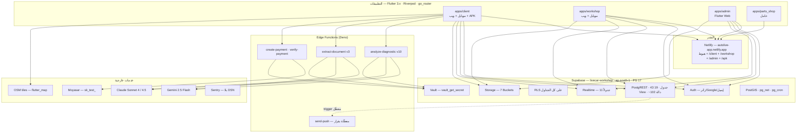
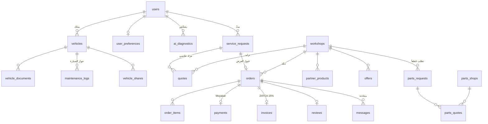
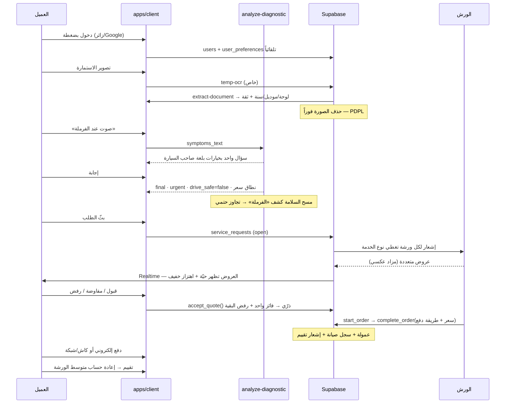

# Auto Live (أوتو لايف) — الملخص التوثيقي والاستراتيجي الشامل

> **الإصدار:** 2.0 — 2026-08-19 · مبني على **المستودع الفعلي + قاعدة البيانات الحيّة**
> **الأسماء السابقة:** لايف كار / Live Car (أُعيدت التسمية رسمياً 2026-07-23، ونُفّذت 2026-07-27)

---

## 0. مصادر هذا التقرير

### 0.1 تصحيح جوهري على الإصدار 1.0

الإصدار الأول من هذا الملف بُني على قاعدة البيانات وحدها، لأن مستودع `livecarksa/ALA` فارغ. **ذلك كان استنتاجاً ناقصاً**: الكود الحقيقي موجود في مستودع آخر — `livecarksa/LivCar` (خاص) — ويحتوي **874 ملفاً**، أربعة تطبيقات Flutter، و42 وثيقة داخلية. أربعة استنتاجات في الإصدار 1.0 كانت خاطئة وصُحّحت هنا (انظر §4.4).

### 0.2 المصادر المعتمدة الآن

| المصدر | ما استُخرج منه |
|---|---|
| **`livecarksa/LivCar`** — الفرع النشط `claude/autolive-landing-redesign-sqa81f` (آخر دفعة **2026-08-19**) | 232 ملف Dart في 4 تطبيقات · 34 ملف SQL · `CLAUDE.md` · `PROGRESS.md` · `DECISIONS.md` · `GAP_REPORT.md` · `docs/ROADMAP.md` · `docs/LAUNCH.md` · `docs/council/` · `docs/legal/` · `docs/ops/` |
| **Supabase `livecar-workshop`** (`xqtlicushtnmofgvikjz`) | 43 جدولاً · 19 View · ~102 دالة · **74 Migration** · سياسات RLS · تريغرات · فهارس · بيانات التشغيل الفعلية |
| **8 Edge Functions منشورة** | الكود المصدري الكامل |
| مهارة `flutterflow-livecar` | ⚠️ **قديمة ومضلِّلة** — انظر §4.5 |

**ما زال غير متاح:** المحادثات السابقة (جلسة جديدة بلا أرشيف)، وملفات Figma.

### 0.3 اصطلاح الثقة
✅ **موثّق** (كود أو قاعدة بيانات) · 🔶 **مستنتج** · ❓ **مفقود**

---

## 1. نظرة عامة ونموذج العمل

### 1.1 وصف المشروع ✅

**أوتو لايف** منصّة سعودية تعرّف نفسها في `CLAUDE.md` بوضوح:

> «ليست تطبيق حجز عادي — هي **سجل رقمي حي لكل سيارة**» يربط العميل، الورشة، الشركاء (وكالات/كفرات/قطع غيار)، والجهات الحكومية (أبشر، نجم، تقدير، ناجز)، عبر محرّك ذكاء اصطناعي.

**المسار الذهبي** كما تعرّفه `GAP_REPORT.md` حرفياً:

> دخول ← إضافة سيارة ← تشخيص AI ← بثّ للورش ← **مزاد عكسي** ← قبول عرض ← طلب ← تتبّع حي ← سجل خدمة ← تقييم.

الفكرة الجوهرية ليست «دليل ورش» بل **مزاد عكسي مسبوق بتشخيص**: العميل لا يبحث عن ورشة — بل يصف عطله، فيستجوبه محرّك ذكاء اصطناعي بثلاثة أسئلة كحدّ أقصى، ثم **تتنافس الورش على طلبه**.

### 1.2 المشكلة والآلية المضادة ✅

| المشكلة | الآلية المبنيّة فعلياً |
|---|---|
| العميل لا يعرف عطله ولا سعره العادل | `ai_diagnostics` + نطاق تكلفة + شريط ثقة % |
| خطر قيادة سيارة معطوبة | `drive_safe` + `enforceSafety()` — حارس حتمي **على السيرفر لا في الـ APK** |
| احتكار الورشة الواحدة للسعر | **المزاد العكسي** — `quotes` + `auction_room_screen` + تفاوض ثلاثي (قبول/مفاوضة/رفض) |
| تغيير السعر بعد الاستلام | `enforce_price_lock` — تجميد السعر بعد الدفع و**قلب الطلب إلى `disputed` تلقائياً عند انحراف > 20%** |
| ضياع سجل الصيانة | `maintenance_logs` + `trigger_orders_autolog` — يُكتب تلقائياً عند الإقفال |
| غياب الفاتورة النظامية | `invoices` بضريبة 15% + **رمز ZATCA TLV QR** |
| ورش بلا أدوات رقمية | كونسول ورشة كامل: لوحة KPI، كانبان، كونسول تشخيص، أرباح، تقييمات، هوية بصرية |

### 1.3 القيمة المقترحة
- **للعميل:** «اعرف عطلك، ثم دع الورش تتنافس عليك» — تشخيص عربي فوري، عروض متعددة حيّة، سعر مقفل، سجل صيانة يتراكم تلقائياً.
- **للورشة:** «طلبات مشخَّصة جاهزة بدل زبائن يتجوّلون» — بثّ فوري، أدوات تسعير وتفاوض، لوحة تشغيل SaaS، فوترة ضريبية، هوية بصرية.
- **للمنصّة:** ملكية طبقة القرار (التشخيص + المزاد + التسعير) — الطبقة الوحيدة التي لا يمكن الالتفاف عليها.

### 1.4 شرائح العملاء ✅

| الشريحة | التطبيق | الحالة |
|---|---|---|
| **مالك السيارة** | `apps/client` — 85 ملف Dart + **APK منشور** (~40 MB) | 🟢 يعمل — 31 مستخدماً |
| **الورشة** | `apps/workshop` — 73 ملف Dart | 🟢 يعمل — 18 ورشة (4 نشطة) |
| **الإدارة / العمليات** | `apps/admin` — 52 ملف Dart (Flutter Web) | 🟢 يعمل — مسؤول واحد |
| **محلّ قطع الغيار** | `apps/parts_shop` — 22 ملف Dart | 🟡 مبني، **0 محلات مسجّلة** |
| **مالك الأسطول / المشاركة** | `vehicle_shares` | 🟡 مبني، 0 صفوف |

**سوق الإطلاق:** جدة ومنطقة مكة المكرمة — أُعيد توجيه الإطلاق إليها بدل الرياض بناءً على شبكة شراكات حيّة (`EXPERT_COUNCIL_REPORT.md`).

### 1.5 نموذج الإيرادات ✅

**المُفعّل: عمولة على الخدمة** — `commission_rates` (14 فئة)، تُطبَّق في `complete_order()` وتُختم في `orders.platform_fee`:

| الفئات | العمولة |
|---|---|
| general, oil_change, battery, brakes, electrical, engine, transmission, suspension, body_paint, inspection, accessories, tires | **10%** |
| wash, ac | **7%** |

> النسب مبدئية بنصّ `PROGRESS.md`: *«14 فئة مزروعة على 10% حتى تصل نسب المؤسس الحقيقية»*. قابلة للتعديل حياً عبر `set_commission_rate` (حدود 0–50%) بصلاحية `platform.pricing`، وتظهر كشاشة «العمولات» في لوحة الإدارة. الورشة ترى صافيها في شاشة «أرباحي».

**مبنيّ وغير مُفعّل:** اشتراكات الورش ومحلات القطع (`subscription_plan`)، عضوية Premium للعميل، **الظهور المميّز `is_featured`** (أقوى رافعة — أعلى معيار في ترتيب المطابقة وغير مُسعّرة)، العروض الترويجية، متجر منتجات الورش، عمولة قطع الغيار.

**الفوترة:** ضريبة 15% ضمنية (`total/1.15`)، ترقيم `INV-YYYY-NNNNNN`، `issue_invoice` idempotent ومقصورة على الورشة بعد الإكمال، مع **ZATCA TLV QR**.

**لوحة الشركة (`ops_*`)** ✅: `investor_pct = 18%`، جدول ملكية (3 مساهمين)، 3 شرائح تمويل، 4 صفقات، 4 أهداف — لوحة قيادة الشركة مدمجة في المنتج.

---

## 2. البنية التقنية

### 2.1 المخطط المعماري



### 2.2 الواجهات الأمامية ✅

**Flutter مكتوب يدوياً — وليس FlutterFlow.**

```yaml
Flutter:      3.x (Dart)
State:        flutter_riverpod ^2.5.1
Navigation:   go_router ^14.2.0
Backend SDK:  supabase_flutter ^2.5.0
HTTP:         dio ^5.4.3
الخرائط:      flutter_map ^7.0.2 + latlong2  # OSM — بلا مفتاح مدفوع
الموقع:       geolocator ^11.0.0
المسح:        mobile_scanner ^5.2.3 (VIN) + image_picker (OCR)
المراقبة:     sentry_flutter ^7.20.2  # يتفعّل فقط بوجود SENTRY_DSN
الرموز:       flutter_svg · iconsax_flutter · qr_flutter
```

| التطبيق | الملفات | الوجهة |
|---|---|---|
| `apps/client` | 85 Dart | موبايل + ويب + **APK منشور على `/apk`** |
| `apps/workshop` | 73 Dart | موبايل + ويب |
| `apps/admin` | 52 Dart | Flutter Web |
| `apps/parts_shop` | 22 Dart | خامل |

**هوية المرحلة 5 — اعتماد المؤسس 2026-07-16** ✅ (`CLAUDE.md` هو مصدر الحقيقة):

| العنصر | القيمة |
|---|---|
| `bluePrimary` | **`#1E40FF`** Cobalt |
| `blueDark` / `blueMid` / `blueSoft` / `blueTint` | `#0A0F2E` / `#1733D6` / `#6B84FF` / `#EEF1FF` |
| `orange` | **`#FF6A1A`** Energy Orange — **CTA فقط** |
| `asphalt` (خلفية ليلية) | `#0A0D17` |
| محايدات | `#F6F7FB` خلفية · `#E6E8EF` حدود · `#8C92A6` نص باهت |
| نصوص | `#0E1320` / `#4A5168` |
| حالات | `#16A34A` / `#DC2626` / `#F59E0B` |
| **الخطوط** | **Tajawal** (عربي واجهة وعناوين) · **IBM Plex Sans** (لاتيني وأرقام جدولية) · **Noto Nastaliq Urdu** — **مضمّنة محلياً، ممنوع `google_fonts` أو أي CDN** |
| **النهاري هو الوجه الرسمي** | الليلي ثانوي |
| **الأرقام لاتينية بالكامل** | لا أرقام عربية-هندية |
| عنصر العلامة الوحيد | `LcPulseLogo` بالشعار الحقيقي — **يُمنع أي نبض مرسوم يدوياً** |
| مكتبة المكونات | `shared/widgets/lc/` — `LcPulseLogo`, `LcKpiCard`, `LcSparkline`, `LcStatusPill`, `LcRadialGauge` |

**قواعد ملزِمة:** RTL أولاً (`start/end` و`EdgeInsetsDirectional`)، `AppColors` فقط، `try/catch` على كل نداء Supabase مترجَم إلى `AppException`، Riverpod لا `setState`، **ثلاث حالات لكل شاشة** (loading/error/data)، كل النصوص عبر `AppLocalizations` بثلاث لغات (ar كامل / en كامل / ur مبدئي)، حجم نص ≥ 16px، `line-height` عربي = 1.6، **لا letter-spacing في العربية**.

**النشر:** موقع Netlify موحّد — `autolive-app.netlify.app` (هبوط + `/client` + `/workshop` + `/admin` + `/privacy.html` + `/terms.html` + `/apk`)، ينشر تلقائياً على كل دفعة.

> ⚠️ **درسان تقنيان مسجّلان:** (١) Flutter Web كان يجلب CanvasKit من `www.gstatic.com` فتظهر شاشة بيضاء عند حجب الـ CDN — حُلّ بـ `FLUTTER_WEB_CANVASKIT_URL=/$app/canvaskit/`. (٢) نفس درس «لا CDN» طُبِّق على الخطوط.

### 2.3 الواجهة الخلفية ✅

Supabase كمنصّة كاملة بلا خادم وسيط. المنطق في مكانين: دوال Postgres `SECURITY DEFINER`، وEdge Functions.

| المشروع | المعرّف | الحالة | الدور |
|---|---|---|---|
| **livecar-workshop** | `xqtlicushtnmofgvikjz` · ap-south-1 · PG 17.6 | 🟢 نشط | **الإنتاج الفعلي** |
| livecar-prod | `akzwyheuqdritbngrcag` | ⚪ متوقّف | فارغ — **الاسم مضلِّل** |
| livecar-dev | `xbbfwlrycjuplivqonfr` | ⚪ متوقّف | غير مستخدم |
| wasla-poc | `bvyjjvwahkhjhbzckfwx` | 🟢 نشط | **مشروع منفصل** لا علاقة له |

**الامتدادات:** `postgis`, `pg_net`, `pg_cron`, `supabase_vault`, `pgjwt`, `pgcrypto`, `uuid-ossp`, `pg_stat_statements`

**Realtime (11 جدولاً):** `vehicles`, `orders`, `reviews`, `notifications`, `parts_shops`, `parts_requests`, `parts_quotes`, `partner_products`, `service_requests`, `quotes`, `messages`

**Storage (7 Buckets):** `vehicle-images` · `avatars` · `workshop-media` · `parts-request-images` · `branding` · `poc-public` (كلها عامة القراءة بروابط، والفهرسة مقصورة على `authenticated` بعد SEC-1) · **`temp-ocr` خاص** تُحذف محتوياته فوراً بعد الاستخراج

**pg_cron:** مهمة واحدة فقط — `cleanup-temp-ocr` **كل دقيقة** (`* * * * *`). لا مهام أخرى مجدولة.

### 2.4 مخطط قاعدة البيانات



**43 جدولاً، RLS مفعّل على جميعها.** أبرز الحقول:

- **`users`** — `auth_id`, `phone`, `language`, `is_premium`/`premium_until`, `is_admin`, `admin_role` (`owner`\|`ops`\|`support`)
- **`vehicles`** — `vin`, `plate_number`, `chassis`, `current_mileage`, `oil_change_interval` (5000)، `istimara_expiry`, `data_source`, `verification_status`, `extracted_confidence`
- **`workshops`** — `location` (PostGIS geography)، `category[]`, `status`, `is_verified`, `is_featured`, `subscription_plan`, `rating_avg`/`rating_count`, **`cr_number`+`cr_source`+`cr_verified_at`+`cr_image_url`**, `vat_number`, `brand_color`, `facade_image_url`, `interior_image_url`
- **`ai_diagnostics`** — `conversation_history` jsonb، `phase` (`question`\|`final`)، `questions_asked` (**قيد `<= 3`**)، `flow_severity`, `severity_legacy`, `confidence`, `drive_safe`, `causes_v4`, `estimated_cost_min/max_sar`, `model_provider`
- **`service_requests`** — `service_type`, `status` (`open`\|`accepted`\|`cancelled`\|`expired`)، `accepted_quote_id`
- **`quotes`** — `amount_sar`, `eta_text`, `status` (`pending`\|`accepted`\|`rejected`\|`withdrawn`\|**`countered`**)، `counter_amount_sar`/`counter_note`/`countered_at` · **قيد فريد (request, workshop)**
- **`orders`** — `order_number`, `status` (7 حالات)، `estimated_price`/`final_price`/**`platform_fee`**، `payment_status`, `payment_method` (`cash`\|`pos`\|`online`)، **`price_locked_at`**, `rejection_count`, `reassignment_of`, `cancelled_by`/`cancellation_reason`, `dispute_reason`
- **`payments`** — `moyasar_id`, `amount`, `method`, `status`
- **`invoices`** — `invoice_number`, لقطة هوية الورشة عند الإصدار، `vat_rate` **15.00**
- **`user_preferences`** (28 حقلاً) — قنوات، 7 مفاتيح تنبيه، `quiet_hours` (22:00–08:00)، ورش مفضّلة/محظورة، `max_workshop_distance_km` (20)، وضوابط خصوصية (`share_vehicle_data_for_ai` …)
- **الحوكمة** — `admin_capabilities` (11 صلاحية على 3 أدوار، **لا يكتبها أي عميل**)، `admin_audit_log` + تريغرات، `consents`, `ocr_extractions`
- **`ops_*`** (9 جداول) — لوحة الشركة + `ops_slas` (مراجعة ورشة 48س · نزاع 24س · طلب متوقف 96س · طلب بلا ردّ 12س · سجل ناقص 72س)

**19 View:** `my_active_orders`, `my_order_history`, `quotes_for_my_requests`, `vehicle_health_summary`, `diagnosis_requests`, `workshop_orders_queue`, `workshop_daily_stats`, `my_submitted_quotes`, `parts_marketplace_open`, `my_parts_quotes`, `pending_workshops_for_review`, و6 Views إدارية.

**48 تريغراً** — أبرزها: `enforce_price_lock`, `trigger_orders_autolog`, `generate_order_number`, `notify_workshops_on_new_request`, `notify_client_on_new_quote`, `notify_on_order_status_change`, `update_workshop_rating`, `guard_privilege_columns`, `create_default_user_preferences`, `sync_workshop_location`, `decrement_partner_stock`, `audit_admin_change`.

**فهارس:** تغطية جيدة — `idx_workshops_location_gist` (PostGIS)، `idx_workshops_category_gin`, `idx_orders_workshop_status_created`, `idx_notifications_user_unread`, `idx_service_requests_open`, `idx_vehicle_documents_renewals_needed`.

### 2.5 خدمات الطرف الثالث ✅

| الخدمة | المزوّد | التفاصيل | الحالة |
|---|---|---|---|
| **تشخيص AI** | **Gemini 2.5 Flash** (افتراضي) + **Claude Sonnet 4.5** | `temperature 0.3` · `maxOutputTokens 4096` (قيد ملزم) · `responseSchema` لدى Gemini · **prompt caching** لدى Claude يخفض دورات الاستجواب ~90% | 🟢 48 من 50 جلسة عبر Gemini |
| **رؤية/OCR** | **Claude Sonnet 4** (افتراضي) + **Gemini 2.5 Flash** احتياطي | VIN · استمارة · سجل تجاري · رخصة قيادة — مع تقدير تكلفة بالريال لكل عملية | 🟢 9 عمليات |
| **الدفع** | **Moyasar** — فاتورة مستضافة | صفر PCI scope · دورة 3DS كاملة مُختبرة حياً | 🟡 **`sk_test_`** — الإطلاق يحتاج `sk_live_` فقط |
| **الإشعارات** | **Supabase Realtime** | ⚠️ **قرار المؤسس 2026-07-29: لا Firebase** — `notifications` + Realtime هي القناة الرسمية | 🟢 يعمل |
| ~~FCM~~ | Firebase | البنية كاملة و`trg_notifications_push` **معطّل (`tgenabled='D'`)** — خامل وغير ضار | ⚪ مؤجَّل بقرار |
| **الخرائط** | **OpenStreetMap عبر `flutter_map`** | بلا مفتاح مدفوع، يعمل على الويب/أندرويد/iOS | 🟢 يعمل |
| **الاستضافة** | **Netlify** (Pro) | نشر تلقائي + بناء APK في نفس المسار | 🟢 يعمل |
| **الأسرار** | **Supabase Vault** عبر `vault_get_secret` | `GEMINI_API_KEY` · `CLAUDE_API_KEY` · `MOYASAR_SECRET_KEY` · `PUSH_HOOK_SECRET` | 🟢 يعمل |
| **مراقبة الأعطال** | **Sentry** — بلا PII إطلاقاً | `sendDefaultPii=false` + `redactPii` يمسح أنماط الجوال السعودي و VIN من الرسائل والآثار، مع اختبارات وحدة | 🟡 ينقص `SENTRY_DSN` |
| SMS OTP | ❓ Unifonic — مخطط في المرحلة C | `sms_enabled` في التفضيلات بلا مزوّد | 🔴 فجوة |
| OBD/تليماتيكس | ❓ | `vehicle_status` جاهز بمصدر `manual` | 🔴 لا تكامل |
| تكاملات حكومية | ❓ أبشر/نجم/تقدير/ناجز | مذكورة في الرؤية، خارج نطاق الإصدار الحالي | 🔴 مؤجَّلة |

---

## 3. حالة الميزات

### 3.1 المسار الذهبي — 11 خطوة ✅

بحسب `GAP_REPORT.md` (تدقيق LC-000) والتحديثات اللاحقة في `PROGRESS.md`:

| # | الخطوة | الحالة | الدليل |
|---|---|---|---|
| 1 | دخول بلا احتكاك | ✅ | `auth_screen.dart` — زائر بضغطة + Google OAuth + إيميل · توفير صف العميل تلقائياً |
| 2 | إضافة سيارة | ✅ | يدوي/تصوير · SmartCapture سيرفري · **حذف الصورة بعد القراءة (PDPL)** · `VinValidator` بخوارزمية SAE J287 |
| 3 | تشخيص AI | ✅ | `analyze-diagnostic` v10 · حوار متعدد الجولات بخيارات · نصوص تحليل متبدّلة · شريط ثقة + نطاق تكلفة |
| 4 | البثّ للورش | ✅ | `service_requests` + Realtime · **بثّ لكل الورش المغطّية للخدمة — قرار مقصود** |
| 5 | **المزاد العكسي** | ✅ | `auction_room_screen` (عميل) + `open_requests_screen` (ورشة) · عروض حيّة · مسافة «X كم» على البطاقة |
| 6 | قبول ذرّي | ✅ | `accept_quote()` بقفول صفّية — **مُثبت بمحاولة قبول مزدوجة فاشلة**: فائز واحد، رفض تلقائي للبقية |
| 7 | الطلب والتنفيذ | ✅ | جدولة/بدء/إلغاء/إكمال · رسائل عربية دقيقة لكل محاولة غير قانونية |
| 8 | التتبّع الحي | ✅ | Realtime على `orders` · دمج `status` + `payment_status` |
| 9 | الدفع | 🟡 | دورة 3DS كاملة مُختبرة حياً على طلب `LC-2026-86761` (25 ﷼) — ينقص `sk_live_` |
| 10 | سجل الخدمة | ✅ | `trigger_orders_autolog` + جواز السيارة + مؤشر إجمالي الإنفاق |
| 11 | التقييم | ✅ | `rate_order_screen` + إعادة حساب متوسط الورشة (يغطي DELETE أيضاً) |

**الخلاصة:** 10 من 11 خطوة تعمل ومُختبرة · خطوة واحدة محجوبة على مفتاح مؤسس · **صفر مفقود في صلب المسار**.

### 3.2 تجربة الورشة الاحترافية (المرحلة 5 — مُغلقة) ✅

| الميزة | التفاصيل |
|---|---|
| **لوحة `lc_workshop_dashboard`** | 4 بطاقات KPI حيّة: طلبات اليوم + شرارة 7 أيام · صافي إيراد الأسبوع بعد العمولة · التقييم + العدد · **متوسط زمن الاستجابة** (من البثّ إلى العرض) |
| **كانبان `/operations`** | 4 أعمدة (جديد بـ QuoteSheet داخل البطاقة · بانتظار العميل · قيد التنفيذ · مكتمل) + درج أرشيف للملغى/المتنازع |
| **كونسول التشخيص `/console`** | تدفّق تقارير بحواف ملوّنة بالخطورة · مقاييس ثقة · أعطال مصنّفة · **قطع مقترحة من مخزون الورشة نفسها** حسب تخطيط نوع الخدمة → فئة · عرض بضغطة واحدة |
| **التفاوض** | قبول / **فاوض على السعر** / رفض — دورة كاملة 500 ← مقابل 400 ← ردّ 450 ← رفض نهائي، مُختبرة 9/9 |
| **المحادثة** | خيط لكل طلب أو مفاوضة · Realtime · RLS للأطراف فقط |
| **الفواتير** | ZATCA TLV QR · `INV-YYYY-NNNNNN` · idempotent |
| **الهوية البصرية** | `brand_color` من **لوحة 8 ألوان مُنسَّقة يتحقّق منها السيرفر** · رفع شعار مقصور على مجلّد الورشة |
| **أرباحي / تقييمات** | صافي/إجمالي/عمولة لكل طلب · قائمة تقييمات حيّة |
| **الإعدادات** | لغة · وضع ليلي · الشاشة الافتراضية (كلاسيك/كانبان/كونسول) |

### 3.3 مبني وغير مُفعّل ⚠️

| الميزة | الصفوف | السبب |
|---|---|---|
| سوق قطع الغيار (`apps/parts_shop` + 3 جداول) | 0 | لا محلات مسجّلة — قرار: نُفعّل أم نجمّد؟ |
| التقييمات | **0** | الشاشة والتريغر يعملان — **فجوة استخدام لا فجوة بناء** (بذرة العرض 4.8/124 على الورشة التجريبية) |
| الفواتير | 0 | `issue_invoice` جاهزة، لم تُستدعَ في طلب حقيقي |
| العروض الترويجية | 0 | لا واجهة إنشاء للورشة |
| وثائق المركبة | 0 | التذكيرات (30/7/1 يوم) **بلا مهمة `pg_cron`** |
| قراءات السيارة الحية | 0 | لا مصدر بيانات |
| مشاركة المركبة | 0 | لا واجهة دعوة |
| **الموافقات** | **0** | ⚠️ خطر امتثال — كاميرا وموقع وبيانات مركبة بلا موافقة مسجّلة |
| Premium | 0 | لا باقات |
| `services` | 0 | حلّ محلّها `partner_products` — ازدواج |

### 3.4 مسار تجربة المستخدم



**رحلة الورشة:** دعوة برابط (14 يوماً) ← استرداد ذرّي يربط `auth_id` ← استكمال السجل التجاري والصور ← مراجعة إدارية (SLA 48س) ← `active` ← بثّ الطلبات ← لوحة/كانبان/كونسول ← عرض ← تفاوض ← تنفيذ ← إقفال بسعر وطريقة دفع ← عمولة تلقائية.

---

## 4. القرارات التقنية والمعمارية

### 4.1 القرارات الموثّقة في `DECISIONS.md` ✅

| الرمز | القرار | السبب |
|---|---|---|
| **D-001** | `ai_diagnostics` يبقى الجدول الأم و`diagnosis_requests` **VIEW** فوقه | مفتاح أجنبي حي + كل السياسات معلّقة بالاسم القديم — VIEW يحقق التوافق **بصفر مخاطر هجرة** |
| **D-002** | `severity` بخريطة مزدوجة (`flow_severity` + `severity_legacy` + `severity`) | عدم كسر مستهلكي v3 · الخريطة: urgent→critical، soon→medium، monitor→low |
| **D-003** | A/B بين Gemini وClaude بنفس الـ prompt وعقد JSON واحد | Gemini افتراضي للكلفة · Claude يستفيد من prompt caching |
| **D-004** | `maxOutputTokens = 4096` **لا يُمَس** | العربية تحتاج tokens أكثر — 1024 كان يقصّ الردّ · **انتهاكه يحتاج إذناً صريحاً** |
| **D-005** | **السلامة تُفرض مرتين — قبل وبعد النموذج** | «الفرامل/المقود/الحرارة/الإيرباغ/تسريب الوقود = أرواح. الحارس الحتمي على السيرفر، لا في الـ APK» |
| **D-006** | 3 أسئلة **سقف صلب** بقيد `CHECK` في القاعدة | «كل سؤال إضافي = عميل يخرج» — حاجز ضد انحراف النموذج |
| **D-007** | جداول المرحلة 2 الموجودة **لا تُلمس** | مخططاتها الحيّة أغنى مما طلب الـ brief |
| **D-008** | RLS لكل جدول جديد عبر الـ helpers الموجودة | تجنّب التكرار اللانهائي في السياسات |

### 4.2 قرارات إضافية مستخرجة من `PROGRESS.md` و`ROADMAP.md` ✅

**١. Supabase كمنصّة كاملة** — لا خادم وسيط. المنطق في دوال `SECURITY DEFINER`، وأسرع سطح هجوم أصغر.

**٢. لا بيئة محلية — التحقق حيّ عبر محاكاة JWT.** بروتوكول الحلقة ينصّ: *«لا Docker هنا — التحقق عبر MCP على القاعدة الحية، بمحاكاة JWT»*. ومعه **درس مسجّل**: فحوص RLS يجب أن تجري تحت دور `authenticated` — لأن دور المالك يتجاوز RLS **ويعطي نجاحاً زائفاً**.

**٣. البثّ للجميع بلا فلترة جغرافية — قرار مقصود.** نصّ الروادماب: *«بثّ للجميع (قرار: لا فلترة جغرافية — **كثافة العروض أوكسجين التجربة**)»*. الفلترة الجغرافية مجدولة صراحةً **عند تجاوز 20 ورشة نشطة**.

**٤. الدخول بلا احتكاك.** زائر بضغطة + Google OAuth — وهذا سبب تفعيل التسجيل المجهول (وليس سهواً).

**٥. لا Firebase — Supabase فقط (2026-07-29).** قرار مؤسس. القناة الرسمية `notifications` + Realtime. بنية FCM كاملة ومعطّلة، يمكن إحياؤها بتغيير صفر كود.

**٦. لا CDN لأي أصل.** الخطوط مضمّنة، وCanvasKit من نسخة البناء — بعد أن سبّب `gstatic` شاشة بيضاء على جهاز المؤسس.

**٧. Moyasar بفاتورة مستضافة** — صفر PCI scope، والمفتاح السري لا يغادر القاعدة إطلاقاً (رؤوس التفويض تُبنى داخل SQL من `vault.decrypted_secrets`).

**٨. الأسرار في Vault عبر RPC — بلا سقوط على `env`.** العطل الموثّق: مخطط `vault` غير مكشوف لـ PostgREST فكانت القراءة تفشل **بصمت** وتسقط على مفتاح قديم محظور. أُلغي السقوط تماماً حتى لا يختبئ العطل.

**٩. Processing-Only لصور الوثائق** — Bucket خاص، مسار مقيّد بمجلّد المستخدم، حذف في `finally`، وختم `deleted_at`، ومهمة تنظيف كل دقيقة.

**١٠. Sentry بلا PII إطلاقاً** — الأنماط السعودية (`05…` / `+9665…`) و VIN تُمسح قبل الإرسال، والشرط مُشفَّر كاختبارات وحدة تعمل في CI.

**١١. بوابة أسرار في CI** — تفشل البناء فور ظهور `service_role` أو `sb_secret` في `apps/` أو `.github/`.

**١٢. الهوية موحّدة عبر `AppColors`/`AppNeu`** — تغيير الرمز يقلب كل شاشة قديمة فوراً.

**١٣. مواصفة ملزِمة للشاشة الرئيسية** — `docs/design/lc_home_main.spec.md` مع بوابة آلية `tools/check_home_spec.sh` (9/9) تعمل في CI قبل أي commit.

### 4.3 التحديات التي واجهت المشروع فعلياً ✅

| التحدي | ما حدث | الحل |
|---|---|---|
| **انقطاع CI كامل** (2026-07-14) | كل الوظائف تفشل في ~3 ثوانٍ بلا سجلات — ميزانية GitHub Actions مستنفدة | المؤسس رفع الميزانية · وضُبطت المضاعفات: إلغاء تكرار `pull_request`، تخطي الدفعات الوثائقية، `concurrency cancel-in-progress` |
| **شاشة بيضاء على جهاز المؤسس** | Flutter Web لا يرسم شيئاً | استُنسخ محلياً بـ Playwright → CanvasKit من `gstatic` محجوب → التحويل للنسخة المحليّة |
| **أعطال Realtime** | `RealtimeSubscribeException(channelError)` على الشاشة المنشورة | `resilientStream` مشترك: بثّ حي ← عند الخطأ جلب فوري + استطلاع 10–30 ثانية · طُبِّق على كل التدفقات |
| **خلل حرج في السجل التلقائي** | التريغر أغفل عمود `service_type` غير القابل للفراغ — **كل إكمال طلب حقيقي كان سينفجر بـ 23502 ويمنع الإكمال نفسه** (لم يظهر لأن الطلب المكتمل الوحيد أُدرج مكتملاً) | اشتقاق النوع من الطلب المرتبط + احتياطي `general` + حارس تكرار |
| **ثغرة قبول ذاتي للعرض** | الورشة كان بإمكانها تعديل حالة عرضها | حصر التحديثات على `pending`/`withdrawn` لطلبات مفتوحة ومغطّاة |
| **بناء APK ينكسر مرتين** | `sentry_flutter 8.x` ثم `package_info_plus 9.0.1` يفترضان Gradle أحدث | تثبيت `sentry_flutter ^7.20.2` + `package_info_plus ^8.0.0` |
| **روابط دعوة ميتة** | تُولَّد على مضيف `livecar-preview` المتقاعد الذي يسبق مسار `/invite` | المضيف الافتراضي صار `autolive-app.netlify.app/workshop` وتمرّره مسارات النشر صراحةً |
| **تراجع بيئي صامت** | البيئة تراجعت وسط العمل فمُحيت ملفات | إعادة بناء + دفع مبكر كحماية |
| **`_headers` بدل `netlify.toml`** | النشر اليدوي لا يعالج `netlify.toml` داخل مجلّد النشر | ملف `_redirects`/`_headers` صريح — يُحترم دائماً |

### 4.4 تصحيحات على الإصدار 1.0 من هذا التقرير ⚠️

| الادّعاء في v1.0 | التصحيح |
|---|---|
| «لا كود مصدري في المستودع — أخطر بند» | ❌ **خطأ.** الكود في `livecarksa/LivCar` — 874 ملفاً، 4 تطبيقات، 42 وثيقة |
| «تطبيق العميل على FlutterFlow» | ❌ **خطأ.** Flutter مكتوب يدوياً + Riverpod + go_router |
| «أعلى عائد: إضافة اعتماد Firebase لتفعيل Push» | ❌ **يناقض قراراً مسجّلاً.** المؤسس قرر: لا Firebase — Realtime هي القناة |
| «بثّ الطلب لكل ورشة = خطر يحتاج حدّ مسافة» | ⚠️ **قرار مقصود** موثّق، والفلترة مجدولة عند > 20 ورشة نشطة |
| «التسجيل المجهول ثغرة» | ⚠️ **قرار منتج** («دخول بلا احتكاك») — يبقى بنداً للمراجعة لا خللاً |
| «هوية `#1E40AF`/`#F97316`» | ❌ **قديمة.** الهوية المعتمدة `#1E40FF` Cobalt + `#FF6A1A` Energy Orange |

### 4.5 ⚠️ مهارة `flutterflow-livecar` قديمة ومضلِّلة

المهارة المثبّتة تصف مشروعاً **غير هذا المشروع**:

| ما تقوله المهارة | الواقع في الكود |
|---|---|
| FlutterFlow (`SupaFlow.client`, Custom Actions, `lc_<area>_<screen>`) | **Flutter يدوي** + Riverpod + go_router |
| `#1E40AF` / `#F97316` | `#1E40FF` / `#FF6A1A` |
| IBM Plex Arabic أو Cairo للمتن | **Tajawal** |
| أرقام عربية-هندية حسب السياق | **لاتينية بالكامل** بقرار |
| قالب `_haversineKm` بـ `.abs()` بدل `sin()` | حساب خاطئ — لا يُنسخ |

**توصية:** تحديث المهارة أو إيقافها — وإلا ستوجّه كل عمل قادم إلى معمارية وهوية خاطئتين.

### 4.6 الديون التقنية القائمة ✅

| # | الدين | الأثر | الحل |
|---|---|---|---|
| **1** | **`complete_order` بتوقيعَين** — القديم `(uuid, numeric, int)` **يثبّت 8%**، والجديد `(uuid, numeric, text)` يقرأ `commission_rates` | خطأ محاسبي مباشر إن استُدعي القديم | حذف القديم بعد التأكد من عدم استخدامه |
| **2** | **44 دالة `SECURITY DEFINER` قابلة للتنفيذ من `anon`** — منها `admin_grant_admin` و`admin_set_workshop_status` (مُتحقَّق منه اليوم) | الحراسة الداخلية تحمي، لكنه **دفاع بطبقة واحدة** | `REVOKE EXECUTE ... FROM anon` على كل دالة إدارية/كتابية |
| **3** | **تريغرات مكرّرة** — `trg_orders_number`+`trigger_orders_number` · `trg_parts_request_number`+`trg_parts_requests_number` · ثنائيات `set_updated_at`/`touch_updated_at` · `sync_parts_shop_location` مرتين | عمل مضاعف وسلوك ملتبس | حذف المكرّر |
| **4** | **حسابان للمسافة** — `match_workshops` بـ PostGIS، `lc_home_feed` بـ Haversine يدوي (`acos`) | نتائج متضاربة + مسح كامل في الشاشة الرئيسية | توحيد على PostGIS |
| **5** | **حماية كلمات المرور المسرّبة معطّلة** | بند مفتوح منذ SEC-1 | تفعيلها من لوحة Supabase |
| **6** | **إعادة التسمية غير مكتملة في Edge Functions** — `analyze-diagnostic` يقول «التشخيص الذكي من **لايف كار**» و`extract-document` يبدأ بـ «**Live Car**» بينما `create-payment` يقول «أوتو لايف» | **يظهر للعميل في ردّ التشخيص** | موجة تسمية ثانية |
| **7** | **`livecar-prod` متوقّف وفارغ بينما الإنتاج على `livecar-workshop`** | خطر تطبيق Migration على المشروع الخطأ | إعادة تسمية وتوثيق |
| **8** | **صفر موافقات مسجّلة** | خطر امتثال PDPL | شاشة موافقة قبل أول كاميرا/موقع |
| **9** | **`poc-server` و`poc-publish` منشورتان بلا مصادقة** (`verify_jwt=false`، بلا سرّ مشترك) و`poc-publish` تكتب بمفتاح `service_role` | نقطتا دخول غير محروستين من أدوات إثبات مفهوم منتهية | حذفهما |
| **10** | **8 مدفوعات عالقة على `initiated`** (890 ﷼ مقابل 145 ﷼ مدفوعة) | بقايا اختبار بلا تسوية ولا انتهاء صلاحية | مهمة `pg_cron` للتسوية |
| **11** | **`severity` بثلاثة أشكال** والقيد يقبل الطقمين معاً | التباس تحليلي (دين مقصود بـ D-002) | إنهاء الهجرة وإسقاط القديم |
| **12** | **`services` مهجور مقابل `partner_products`** | ازدواج نموذج | حسم المرجع |
| **13** | **13 من 18 ورشة معلّقة** (بذور جدة) | عمق سوق ضعيف | جردة وتفعيل |
| **14** | **`CLAUDE.md` قديم جزئياً** — يذكر Google Maps (الواقع OSM)، «ثلاثة منتجات» (الواقع أربعة)، ومحرك Claude وحده (الواقع Gemini افتراضي)، وتاريخه «2025» | يضلّل أي مطوّر جديد | تحديث |
| **15** | **جلسات متوازية تكتب فوق نفس موقع Netlify** — «آخر دفعة تكسب» | خطر عرض خارجي على نسخة غير متوقعة | تجميد LC-A5 على **كل** الفروع |
| **16** | **6 فروع غير مدموجة** على `LivCar`، و`main` مجرد قالب فارغ | لا مصدر حقيقة واحد | دمج الفروع في `main` |
| **17** | **بيانات دخول تجريبية مكتوبة في `README.md`** (`demo-*@livecar.sa` بكلمة مرور ظاهرة) | مقبول لمستودع خاص — خطر عند أي فتح | نقلها إلى أسرار |
| **18** | لا مزوّد SMS/واتساب رغم وعد التفضيلات | وعد بلا تنفيذ | Unifonic (مجدول) أو إخفاء الخيار |

---

## 5. خارطة الطريق والخطوات القادمة

### 5.1 الوضع الحالي بصدق ✅

**المراحل المُغلقة:** المرحلة 4 (تطبيق الورش) · المرحلة 5 (تجربة الورشة الاحترافية، LC-501→508) · المرحلة A (تفعيل الدفع والمعاينة الحيّة) · المرحلة B (B1–B9) · المرحلة C (إعادة هندسة الرئيسية، C1–C6).

**حكم مجلس الخبراء (6 أعضاء، 2026-06-11):** «**جاهز بشروط** — Beta مغلقة في جدة/مكة بعد تنفيذ الفجوات الحرجة الست» — والفجوات الست **نُفِّذت كلها**.

**لكن:** آخر طلب حقيقي **2026-07-28**، وآخر تشخيص **2026-08-15**. أي أن التشخيص ما زال يُستخدم بينما **توقّفت المعاملات منذ ثلاثة أسابيع**. إجمالي المدفوع فعلياً **145 ريالاً** (اختباري). المنتج جاهز — **التجربة المغلقة لم تبدأ**.

**العائق ليس الكود.** هو أربعة بنود بشرية في `HUMAN LANE`.

### 5.2 المسار البشري — العائق الحقيقي 🔴

| المسؤول | المهمة | الحالة |
|---|---|---|
| **المؤسس** | استبدال `sk_test_` بـ `sk_live_` في Vault — **صفر تغيير كود** | ⏳ مفتوح |
| **المؤسس** | جوالان مشحونان + **بروفة المسار الذهبي (LC-A4)** — المزاد الحي هو المشهد المحوري | ⏳ مفتوح |
| **المؤسس** | حساب Apple Developer (يبدأ مبكراً — التوثيق يأخذ أياماً) | ⏳ مفتوح |
| **المؤسس** | إكمال حقول المالك القانوني والسجل التجاري في وثيقتَي الخصوصية والشروط | ⏳ مفتوح |
| **فارس** | التزام **3–5 ورش** من علاقات LOI + تسليم روابط الدعوة | ⏳ مفتوح |
| **عبدالله** | مجموعة واتساب الورش + جدول الكونسيرج | ⏳ مفتوح |

> نموذج التشغيل جاهز: `docs/ops/PILOT_RUNBOOK.md` يعرّف **نموذج الكونسيرج لأول 20 طلباً** — يُرى خلال ≤ 5 دقائق، عرض خلال ≤ 15 دقيقة، والكونسيرج **يسعى ليكون العرض الثاني لا الوحيد** — مع جدول تصعيد بمواعيد، وعتبات قرار أسبوعية، واستعلام KPI يومي واحد **جرى تنفيذه حياً بتوقيت الرياض ويعمل**.

### 5.3 مهام المنتج المتبقية (من `ROADMAP.md`) ✅

| الرمز | المهمة | الأولوية |
|---|---|---|
| **LC-A4** | بروفة المسار الذهبي بجوالين على بيانات حيّة | 🔴 قاطعة |
| **LC-A5** | قاعدة التجميد: لا دفعات على client/workshop قبل أي عرض خارجي بـ 24 ساعة — **على كل الفروع** | 🔴 قاطعة |
| **LC-C7** | لقطات التحقق اليدوي للحالات الأربع + الأردية | 🟠 عالية |
| **LC-C8** | الإدخال الصوتي الفعلي لبوابة التشخيص (speech-to-text) | 🟠 عالية |
| **LC-409** | **النزاعات والشكاوى** — جدول شكاوى + إبلاغ من الطرفين + طابور معالجة إداري | 🟠 عالية (يوجد طلبان `disputed` بلا مسار معالجة) |
| **LC-410** | **آلية الضمان** — ختم صلاحية عند الإكمال + مطالبة داخل النافذة + قسم إداري | 🟡 متوسطة |

### 5.4 أولوياتي المقترحة (مبنيّة على ما رأيته)

**P0 — قبل أي عرض خارجي**

| # | المهمة | لماذا |
|---|---|---|
| P0-1 | **`sk_live_` + LC-A4 + LC-A5** | البوابة الوحيدة بين «جاهز» و«شغّال» |
| P0-2 | **`REVOKE EXECUTE` من `anon` على 44 دالة** | `admin_grant_admin` مكشوفة لدور مجهول — بطبقة حراسة واحدة |
| P0-3 | **حذف `complete_order` القديمة (8%)** | خطأ محاسبي مباشر في إيراد المنصّة |
| P0-4 | **حذف `poc-server` و`poc-publish`** | نقطتا دخول غير محروستين لأدوات منتهية |
| P0-5 | **تسجيل الموافقات (`consents`)** | التزام PDPL — كاميرا وموقع وبيانات مركبة |
| P0-6 | **توحيد الاسم على «أوتو لايف»** في الـ prompts | العميل يرى الاسم القديم في ردّ التشخيص |
| P0-7 | **دمج الفروع الستة في `main`** | لا مصدر حقيقة واحد اليوم |

**P1 — لتشغيل التجربة المغلقة**

| # | المهمة | لماذا |
|---|---|---|
| P1-1 | **تفعيل 15–20 ورشة في جدة** عبر `provision_pilot_workshops` + جردة الـ 13 المعلّقة | **العائق الحقيقي** — عمق السوق لا الكود |
| P1-2 | **LC-409 النزاعات** | طلبان متنازعان بلا مسار معالجة |
| P1-3 | **تفعيل الفوترة في الإقفال** | التزام ضريبي + مطلب أي ورشة نظامية |
| P1-4 | **تسوية المدفوعات العالقة** بمهمة `pg_cron` | 8 عمليات معلّقة ورقم ينمو |
| P1-5 | **تذكيرات وثائق المركبة** (`pg_cron` على 30/7/1 يوم) | يحوّل التطبيق من «عند العطل» إلى **حضور شهري** — أقوى محرّك احتفاظ متاح |
| P1-6 | **LC-C7 + LC-C8** | إغلاق المرحلة C |
| P1-7 | **`SENTRY_DSN`** | البنية جاهزة — خطوة واحدة |
| P1-8 | **توحيد حساب المسافة + حذف التريغرات المكرّرة** | اتساق وأداء |

**P2 — بعد التجربة المغلقة**

فلترة جغرافية عند > 20 ورشة نشطة (مجدولة) · LC-410 الضمان · iOS/TestFlight · SMS OTP (Unifonic) · **webhook ميسر الموقّع** · حسم سوق قطع الغيار · تسعير الظهور المميّز (أقرب مصدر إيراد ثانٍ) · باقات اشتراك الورش · تكاملات حكومية · تسجيل صوت المحرك · دومين مخصص · تحديث `CLAUDE.md` ومهارة `flutterflow-livecar`.

### 5.5 مؤشرات النجاح 🔶

| المؤشر | اليوم | هدف 30 يوماً |
|---|---|---|
| ورش نشطة موثّقة | **2** | 15–20 |
| طلبات مكتملة/أسبوع | ~0 | 20 |
| **متوسط الزمن حتى أول عرض** | — | ≤ 15 دقيقة (سقف الكونسيرج) |
| **نسبة الطلبات بعرضين فأكثر** | — | ≥ 70% (فرضية «العروض المتعددة») |
| تشخيص ← بثّ طلب | 22 من 50 (44%) | ≥ 60% |
| طلب ← إنجاز | 6 من 18 (33%) | ≥ 70% |
| تقييمات مسجّلة | **0** | ≥ 80% من المنجز |
| إيراد عمولة | ~0 | أول 1,000 ﷼ |

---

## ملحق أ — بطاقة أرقام (2026-08-19) ✅

| البند | القيمة |
|---|---|
| مستخدمون | **31** (1 مسؤول · 0 Premium) |
| ورش | **18** — 4 نشطة (2 موثّقة) · 14 معلّقة · جدة عدا واحدة |
| مركبات · تشخيصات | **5** · **50** (30 نهائية: 21 عاجل، 9 قريباً · 48 عبر Gemini) |
| طلبات خدمة · عروض | **22** (10 مفتوحة) · **11** (7 مقبول، 1 مقابل، 3 معلّق) |
| طلبات | **18** — 6 مكتملة · 5 مقبولة · 3 معلّقة · 2 قيد التنفيذ · **2 متنازع** |
| مدفوعات | **10** — 2 مدفوعة (145 ﷼) · 8 عالقة (890 ﷼) |
| إشعارات · منتجات · OCR · دعوات · تدقيق | 66 · 9 · 9 · 3 · 19 |
| تقييمات · فواتير · قطع غيار · موافقات · Push Tokens | **0** لكلٍّ |
| آخر طلب · آخر تشخيص | 2026-07-28 · 2026-08-15 |

## ملحق ب — الأصول التقنية ✅

- **المستودع:** `livecarksa/LivCar` (خاص) — الفرع النشط `claude/autolive-landing-redesign-sqa81f`
- **الفروع غير المدموجة (6):** `live-car-platform-N8PHO` · `admin-ops-board-jlld8c` · `admin-p1` · `admin-audit-trail` · `admin-crm-refresh` · `autolive-landing-redesign-sqa81f`
- **الروابط الحيّة:** الهبوط `autolive-app.netlify.app` · `/client/` · `/workshop/` · `/admin/` · `/apk` · `/privacy.html` · `/terms.html`
- **Supabase:** `xqtlicushtnmofgvikjz` (`livecar-workshop`) · ap-south-1 · PG 17.6
- **Edge Functions:** `analyze-diagnostic` v10 · `extract-document` v3 · `create-payment` v3 · `verify-payment` v4 · `send-push` v1 (خاملة) · `test-gemini-key` · `poc-server` · `poc-publish`
- **CI (6 مسارات):** `flutter-ci` (تحليل + اختبارات + مسبار Realtime ≤ 5 ثوانٍ + بوابة أسرار) · `build-apk` · `deploy-netlify` · `deploy-pages` (معطّل بلا `PAGES_DEPLOY_TOKEN`) · `debug-realtime` · `blank`
- **اختبارات SQL حيّة:** `supabase/tests/lc40x_policy_tests.sql` (15 فحصاً ذاتي البذر والتنظيف) · `lc506_507_policy_tests.sql` (11 فحصاً)
- **وثائق مرجعية:** `CLAUDE.md` · `DECISIONS.md` · `GAP_REPORT.md` · `PROGRESS.md` · `docs/ROADMAP.md` · `docs/LAUNCH.md` · `docs/UX_JOURNEY.md` · `docs/flows/USER_FLOWS.md` · `docs/design/lc_home_main.spec.md` · `docs/ops/PILOT_RUNBOOK.md` · `docs/ops/WHATSAPP_TEMPLATES.md` · `docs/council/` (7 تقارير) · `docs/legal/` · `docs/partnerships/BIN_SHIHON_ONBOARDING.md`

---

*أُعدّ هذا المرجع بقراءة مباشرة لمستودع `LivCar` وقاعدة البيانات الحيّة وكود Edge Functions. كل رقم قابل لإعادة التحقق. المحادثات السابقة لم تكن متاحة.*
