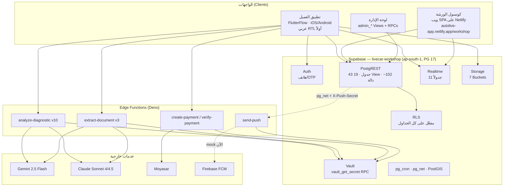
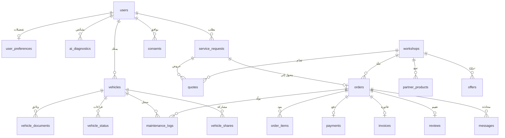
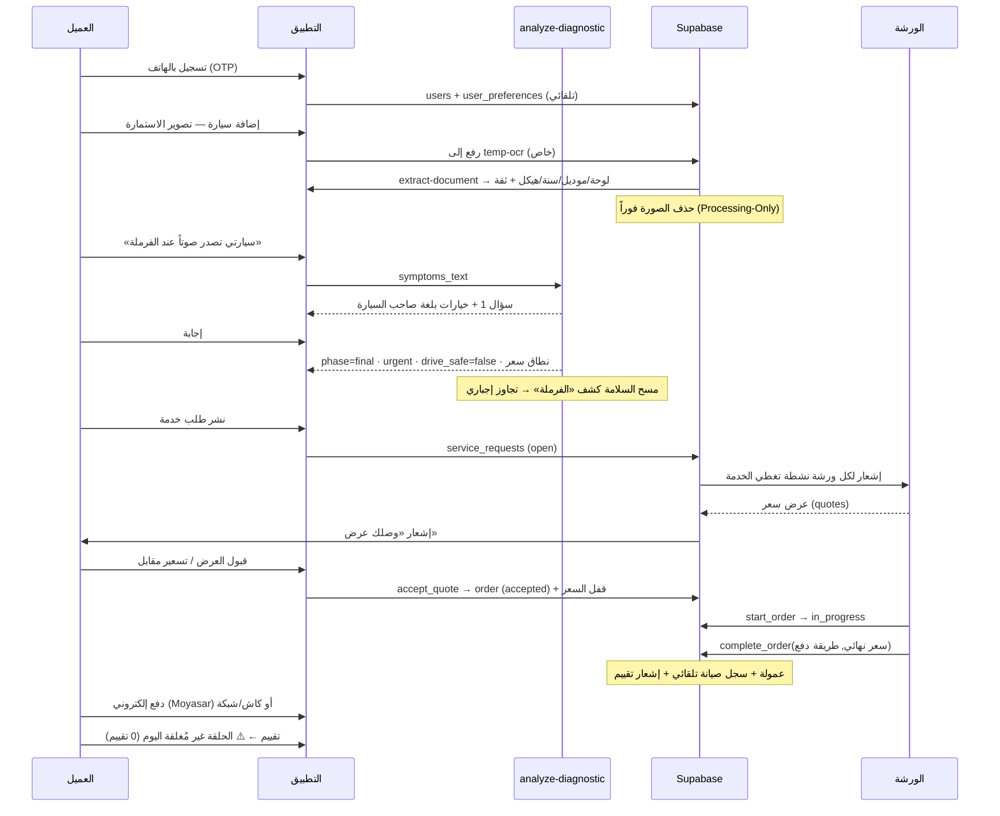

# Auto Live (أوتو لايف) — الملخص التوثيقي والاستراتيجي الشامل

> **الحالة:** مرجع تطوير واستراتيجية — محدَّث بتاريخ **2026-08-19**
> **الأسماء السابقة:** Live Car / لايف كار — وقبلها "Auto Life" في بعض المراسلات

---

## 0. مصادر هذا التقرير وحدوده (اقرأ هذا أولاً)

هذا القسم موجود لأن دقّة المرجع أهم من طوله.

### 0.1 ما لم أستطع الوصول إليه

| المصدر المطلوب | الحالة |
|---|---|
| **المحادثات السابقة** | ❌ غير متاحة. هذه جلسة جديدة بذاكرة فارغة — لا يوجد أرشيف محادثات على هذا الجهاز (`~/.claude/projects` يحتوي على جلسة اليوم فقط). |
| **مستودع الكود** (`livecarksa/ALA`) | ⚠️ فارغ فعلياً — ملف `README.md` وحيد محتواه `# ALA`. لا كود مصدري، لا مخططات، لا وثائق سابقة. |
| **مشروع FlutterFlow** | ❌ لا يوجد تصدير للكود في المستودع. |
| **ملفات Figma / مخططات مرسومة** | ❌ لم يُعثر على أي منها. |

### 0.2 ما بنيتُ عليه هذا التقرير (مصادر موثّقة ومُتحقَّق منها)

| المصدر | ما استخرجته |
|---|---|
| **قاعدة بيانات Supabase الحيّة** `livecar-workshop` (`xqtlicushtnmofgvikjz`) | 43 جدولاً، 19 View، ~102 دالة/RPC، **74 Migration** مؤرّخة من 2026-05-06 إلى 2026-08-16، سياسات RLS، Buckets، Realtime، وبيانات التشغيل الفعلية |
| **Edge Functions المنشورة** (8 دوال) | الكود المصدري الكامل لمحرّك التشخيص، الـ OCR، الدفع، والإشعارات |
| **بيانات التشغيل الفعلية** | 31 مستخدماً، 18 ورشة، 50 جلسة تشخيص، 18 طلباً، 10 عمليات دفع — أي أن المنتج **شغّال بمستخدمين حقيقيين**، ليس تصميماً على ورق |
| **مهارة `flutterflow-livecar`** المثبّتة | هوية العلامة، قواعد الواجهة، معايير FlutterFlow، وأنماط التكامل المعتمدة |

### 0.3 اصطلاح الثقة المستخدم في كل التقرير

- ✅ **موثّق** — مُتحقَّق منه مباشرة من قاعدة البيانات أو كود Edge Function.
- 🔶 **مستنتج** — استنتاج منطقي قوي من بنية البيانات، لكنه يحتاج تأكيدك.
- ❓ **مفقود** — لا يوجد دليل؛ يحتاج إدخالاً منك.

> **طلب واحد منك:** إن كانت لديك محادثات أو مستندات سابقة (استراتيجية، تسعير، دراسة جدوى، Figma)، ارفعها وسأدمجها في هذا الملف نفسه فيصبح المرجع الوحيد الكامل.

---

## 1. نظرة عامة ونموذج العمل

### 1.1 وصف المشروع

**أوتو لايف** منصّة سعودية (أولى مدنها **جدة**) تربط مالك السيارة بالورشة عبر **طبقة تشخيص ذكي** تسبق الحجز. الفكرة الجوهرية — والمثبتة في البنية — أن العميل **لا يُطلب منه أن يعرف عطله**؛ يصف الأعراض بلغته، فيستجوبه محرّك ذكاء اصطناعي بثلاثة أسئلة كحد أقصى، ثم يُخرج تشخيصاً مبدئياً + نطاق سعر واقعي + قرار سلامة (هل السيارة صالحة للقيادة؟)، وعندها فقط يدخل السوق ليستقبل عروض الورش.

هذا ليس "دليل ورش" ولا "تطبيق حجز" — بل **سوق مُدار بالمعلومة**، حيث المعلومة (التشخيص + السعر التقديري) هي ما يوازن اختلال المعرفة بين العميل والورشة.

### 1.2 المشكلة التي يعالجها 🔶

البنية التقنية نفسها تكشف المشكلات المستهدَفة — كل مشكلة لها آلية مضادّة مبنيّة في القاعدة:

| المشكلة في سوق صيانة السيارات | الآلية المضادة المبنيّة فعلياً ✅ |
|---|---|
| اختلال المعرفة: العميل لا يعرف عطله ولا سعره العادل | `ai_diagnostics` + `estimated_cost_min/max_sar` — نطاق سعر قبل دخول الورشة |
| خطر السلامة: قيادة سيارة معطوبة جهلاً | `drive_safe` + `enforceSafety()` — تجاوز إجباري يرفع الخطورة لـ `urgent` عند ذكر الفرامل/المقود/الحرارة/الوقود/الوسائد الهوائية |
| غموض التسعير وتغييره بعد الاستلام | `quotes` + `price_locked_at` + `enforce_price_lock` — قفل السعر بعد القبول |
| صعوبة العثور على ورشة قريبة موثوقة | `match_workshops` (PostGIS) + `is_verified` + `rating_avg` |
| ضياع سجل صيانة السيارة | `maintenance_logs` — يُكتب **تلقائياً** عند إقفال كل طلب |
| غياب الفاتورة النظامية | `invoices` بضريبة 15% + رقم السجل التجاري والرقم الضريبي للورشة |
| ورش بلا أدوات تشغيل رقمية | كونسول ورشة كامل: طابور طلبات، عروض، تفاوض، محادثة، منتجات، هوية بصرية |

### 1.3 القيمة المقترحة

**للعميل:** «اعرف عطلك وسعره العادل قبل أن تدخل الورشة» — تشخيص عربي فوري، عروض متعددة تتنافس، سعر مقفل، وسجل صيانة يتراكم تلقائياً.

**للورشة:** «طلبات جاهزة ومشخّصة بدل زبائن يتجوّلون» — تدفّق طلبات مسبقة التشخيص، أدوات تسعير وتفاوض، لوحة تشغيل، فوترة ضريبية، وهوية بصرية داخل التطبيق.

**للمنصّة:** ملكية طبقة القرار (التشخيص + المطابقة + التسعير) — وهي الطبقة الوحيدة التي لا يمكن للورشة أن تلتفّ عليها.

### 1.4 شرائح العملاء المستهدفة ✅ (مثبتة في القاعدة)

| الشريحة | الجدول/الدليل | الحالة الفعلية |
|---|---|---|
| **مالك السيارة الفرد** | `users` + `vehicles` + `user_preferences` | 31 مستخدماً، 5 مركبات |
| **الورشة** (شريك أساسي) | `workshops` — `partner_type`, `subscription_plan`, `cr_number`, `vat_number` | 18 ورشة (4 نشطة في جدة، منها 2 موثّقة) |
| **محلّ قطع الغيار** | `parts_shops` + `parts_requests` + `parts_quotes` | مبني بالكامل، **0 صفوف** — لم يُفعَّل بعد |
| **مالك الأسطول / المشاركة العائلية** | `vehicle_shares` (`viewer` \| `manager`) | مبني، 0 صفوف |
| **الإدارة الداخلية (Ops)** | `admin_capabilities` (`owner`/`ops`/`support`) + `ops_*` | مفعّل — مسؤول واحد |

### 1.5 نموذج الإيرادات ✅ (مستخرج من الجداول والدوال — ليس افتراضاً)

**المصدر الأول والمُفعّل: عمولة على الخدمة**

جدول `commission_rates` — نسبة لكل نوع خدمة، تُطبَّق في `complete_order()` وتُخزَّن في `orders.platform_fee`:

| نوع الخدمة | العمولة |
|---|---|
| general, oil_change, battery, brakes, electrical, engine, transmission, suspension, body_paint, inspection, accessories, tires | **10%** |
| wash, ac | **7%** |

النسب قابلة للتعديل حياً عبر `set_commission_rate()` بصلاحية `platform.pricing` — أي أن التسعير أداة تشغيلية لا ثابت مبرمج.

**مصادر مبنيّة لكنها غير مُفعّلة بعد:**

| المصدر | الدليل | الحالة |
|---|---|---|
| **اشتراكات الورش** | `workshops.subscription_plan` + `admin_update_subscription()` | البنية جاهزة، كل الورش `free` |
| **اشتراكات محلات القطع** | `parts_shops.subscription_plan` (`free`/`basic`/`pro`) | البنية جاهزة، لا محلات |
| **عضوية Premium للعميل** | `users.is_premium` + `premium_until` | البنية جاهزة، **0 مشترك** |
| **الظهور المميّز (Featured)** | `workshops.is_featured` — أعلى معايير الترتيب في `match_workshops` | الرافعة الإعلانية الأقوى — غير مُسعّرة |
| **العروض الترويجية** | `offers` + `views_count`/`clicks_count` | مبني، 0 صفوف |
| **متجر منتجات الورش** | `partner_products` + `order_items.partner_product_id` | 9 منتجات فقط |
| **عمولة قطع الغيار** | `parts_quotes.total_price` + `delivery_fee` | غير مُفعّل |

**الفوترة:** `invoices` — ضريبة قيمة مضافة **15%** مع بيانات الورشة النظامية (CR + الرقم الضريبي). أُصدرت **0 فواتير** حتى الآن.

**بيانات الشركة (مجلس داخلي — `ops_*`)** ✅: `ops_settings.investor_pct = **18%**`، بالإضافة إلى `ops_cap_table` (3 مساهمين)، `ops_tranches` (3 شرائح تمويل)، `ops_deals` (4 صفقات)، `ops_objectives` (4 أهداف)، `ops_projects`, `ops_invoices`, `ops_tools`. هذه ليست ميزات منتج — إنها **لوحة قيادة الشركة نفسها** مدمجة في المنتج.

---

## 2. البنية التقنية (Tech Stack & Architecture)

### 2.1 المخطط المعماري العام



### 2.2 الواجهات الأمامية (Frontend)

| الواجهة | التقنية | الحالة |
|---|---|---|
| **تطبيق العميل** | **FlutterFlow** (Flutter/Dart) 🔶 | القواعد الملزِمة موثّقة في مهارة `flutterflow-livecar`: تسمية الصفحات `lc_<area>_<screen>`، الإجراءات `lc<Area><Action>`، الويدجت `LC<Area><Widget>`، الوصول لـ Supabase عبر `SupaFlow.client` داخل Custom Actions حصراً |
| **كونسول الورشة** | **تطبيق ويب SPA على Netlify** ✅ | مثبت في `provision_pilot_workshops()`: رابط الدعوة `https://autolive-app.netlify.app/workshop/#/invite/<token>` — توجيه Hash Routing |
| **لوحة الإدارة/العمليات** | واجهة ويب 🔶 | تعليق `ops_slas` يذكر دالة `getPulse` التي تقرأ عتبات الخرق — أي أن هناك "لوحة اليوم" في كود الواجهة |

**نظام التصميم (ملزِم — من المهارة):**

| العنصر | القيمة |
|---|---|
| `primary` | `#1E40AF` أزرق ملكي |
| `primaryDark` | `#0B1F4D` |
| `accent` | `#F97316` برتقالي — **لأزرار الإجراء فقط، لا يسود أبداً** |
| `background` / `surface` | `#FFFFFF` / `#F8FAFC` |
| `textPrimary` / `textSecondary` | `#0F172A` / `#64748B` |
| `success` / `warning` / `error` | `#16A34A` / `#F59E0B` / `#DC2626` |
| خطوط عربية | `IBM Plex Arabic` أو `Cairo` (متن) — `Alexandria` أو `Tajawal` (عناوين) |
| الأردية / الإنجليزية | `Noto Nastaliq Urdu` / `Inter` |
| المسافات | سُلّم 4/8/12/16/24/32 |
| **ممنوع** | بنفسجي، أخضر، نيون، cyberpunk، تدرّجات عشوائية |

**اللغة والاتجاه:** العربية أولاً ثم الأردية ثم الإنجليزية — RTL هو الافتراضي، `EdgeInsetsDirectional` إجباري، لا نصوص مكتوبة داخل الكود. القاعدة تدعم ذلك: `product_categories` ثلاثي اللغة (`name_ar`/`name_en`/`name_ur`)، و`user_preferences.language`.

### 2.3 الواجهة الخلفية (Backend)

**Supabase كمنصّة كاملة** — لا يوجد خادم تطبيقات منفصل. المنطق يعيش في مكانين فقط: دوال Postgres (`SECURITY DEFINER`) وEdge Functions (Deno).

**مشاريع Supabase (المؤسسة `cxlyxkdebgcfrnphloul`):**

| المشروع | المعرّف | المنطقة | الحالة | الدور الحقيقي |
|---|---|---|---|---|
| **livecar-workshop** | `xqtlicushtnmofgvikjz` | ap-south-1 (مومباي) | 🟢 نشط | **قاعدة العمل الفعلية** — كل الجداول والبيانات هنا |
| livecar-prod | `akzwyheuqdritbngrcag` | ap-southeast-1 | ⚪ متوقّف | فارغ/غير مستخدم — **الاسم مضلِّل** |
| livecar-dev | `xbbfwlrycjuplivqonfr` | ap-southeast-1 | ⚪ متوقّف | غير مستخدم |
| wasla-poc | `bvyjjvwahkhjhbzckfwx` | eu-central-1 | 🟢 نشط | **مشروع منفصل** (حجوزات/تسويات) — لا علاقة له بأوتو لايف |

> ⚠️ **خطر تشغيلي:** الإنتاج يعمل على مشروع اسمه `workshop`، بينما المشروع المسمّى `prod` متوقّف وفارغ. هذا فخّ يوم يأتي مطوّر جديد أو يُطبَّق Migration على المشروع الخطأ.

**امتدادات Postgres المفعّلة ✅:** `postgis` (المطابقة الجغرافية)، `pg_net` (نداء Edge Functions من التريغرات)، `pg_cron` (مهام مجدولة)، `supabase_vault` (الأسرار)، `pgjwt`, `pgcrypto`, `uuid-ossp`, `pg_stat_statements`.

**Realtime مفعّل على 11 جدولاً ✅:** `vehicles`, `orders`, `reviews`, `notifications`, `parts_shops`, `parts_requests`, `parts_quotes`, `partner_products`, `service_requests`, `quotes`, `messages`.

**Storage — 7 Buckets ✅:**

| Bucket | عام؟ | الغرض |
|---|---|---|
| `vehicle-images` | نعم | صور المركبات |
| `avatars` | نعم | صور المستخدمين |
| `workshop-media` | نعم | شعار/غلاف/معرض الورشة |
| `parts-request-images` | نعم | صور طلبات القطع |
| `branding` | نعم | هوية الورشة البصرية |
| `poc-public` | نعم | أصول إثبات المفهوم |
| **`temp-ocr`** | **لا (خاص)** | صور الوثائق — **تُحذف فور الاستخراج** (Processing-Only) |

### 2.4 مخطط قاعدة البيانات (Database Schema)

**43 جدولاً في `public`، RLS مفعّل على جميعها** (باستثناء `spatial_ref_sys` التابع لـ PostGIS).

#### النواة — رحلة العميل



#### الجداول الأساسية (الحقول الحاسمة فقط)

**`users`** — `id`, `auth_id`→`auth.users`, `full_name`, `phone`, `language` (افتراضي `ar`), `is_premium`, `premium_until`, `is_admin`, `admin_role` (`owner`\|`ops`\|`support`)

**`vehicles`** — `user_id`, `vin`, `plate_number`, `chassis`, `make`, `model`, `year`, `color`, `fuel_type`, `transmission`, `current_mileage`, `last_oil_change_date/mileage`, `oil_change_interval` (افتراضي 5000)، `istimara_expiry`, `owner_name`, `data_source` (`manual`\|OCR)، `verification_status` (`unverified`\|`verification_pending`\|`verified`)، `extracted_confidence`

**`workshops`** — `auth_id`, `name`/`name_en`, `phone`, `address`, `city` (افتراضي «الرياض»), `district`, `lat`/`lng`/**`location` (PostGIS geography)**, `category[]`, `status` (`pending`\|`active`\|`suspended`\|`inactive`), `is_verified`, `is_featured`, `partner_type`, `subscription_plan`, `rating_avg`/`rating_count`, `total_orders`, **`cr_number` + `cr_source` + `cr_verified_at` + `cr_image_url`** (السجل التجاري), `facade_image_url`, `interior_image_url`, `vat_number`, `brand_color`, `approved_at`/`approved_by`/`rejection_reason`

**`ai_diagnostics`** — `user_id`, `vehicle_id`, `workshop_id`, `conversation_history` (jsonb)، `phase` (`question`\|`final`)، `questions_asked`, `flow_severity` (`urgent`\|`soon`\|`monitor`)، `severity_legacy` (`critical`\|`medium`\|`low`)، `confidence`, `drive_safe`, `diagnosis`, `causes_v4` (jsonb)، `possible_causes[]`, `recommended_action_ar`, `estimated_cost_min/max_sar`, `urgency_message`, `requires_immediate_attention`, `model_provider`

**`service_requests`** — `user_id`, `vehicle_id`, `diagnosis_id`, `description`, `service_type`, `status` (`open`\|`accepted`\|`cancelled`\|`expired`)، `accepted_quote_id`, `order_id`

**`quotes`** — `request_id`, `workshop_id`, `amount_sar`, `eta_text`, `note`, `status` (`pending`\|`accepted`\|`rejected`\|`withdrawn`\|`countered`)، **`counter_amount_sar` + `counter_note` + `countered_at`** (التفاوض)

**`orders`** — `order_number` (تسلسل)، `user_id`, `workshop_id`, `vehicle_id`, `diagnosis_id`, `status` (`pending`\|`accepted`\|`rejected`\|`in_progress`\|`completed`\|`cancelled`\|`disputed`)، `estimated_price`, `final_price`, **`platform_fee`**, `payment_status`, `payment_method` (`cash`\|`pos`\|`online`)، **`price_locked_at`**, `rejection_count`, `reassignment_of`, `cancelled_by`, `dispute_reason`, `admin_note`، وطوابع `accepted_at`/`started_at`/`completed_at`/`cancelled_at`/`rejected_at`

**`payments`** — `order_id`, `user_id`, **`moyasar_id`**, `amount`, `currency` (`SAR`)، `method`, `status`

**`invoices`** — `invoice_number`, `order_id`, بيانات الورشة النظامية (`workshop_vat_number`, `workshop_cr_number`)، `vat_rate` (**15.00**)، `subtotal_sar`, `vat_sar`, `total_sar`

**`maintenance_logs`** — `vehicle_id`, `order_id`, `workshop_id`, `service_type`, `mileage`, `cost`, `source` (افتراضي **`autolive`**)

**`user_preferences`** (28 حقلاً) — قنوات الإشعار (`push`/`email`/`sms`/`whatsapp`)، 7 مفاتيح تنبيه موضوعية، **`quiet_hours_start/end`** (22:00–08:00)، `preferred_workshop_ids[]`/`blocked_workshop_ids[]`, `workshop_priority`, `max_workshop_distance_km` (20)، `language`, `theme_mode`, `unit_system`, `currency_display`، و**ضوابط خصوصية**: `share_location`, `share_vehicle_data_for_ai`, `share_data_for_research`, `ai_diagnostic_sensitivity`

**سوق قطع الغيار:** `parts_shops` (`specialties[]`, `brands_covered[]`, `delivery_areas[]`, PostGIS)، `parts_requests` (`parts` jsonb, `urgency`, **انتهاء تلقائي بعد 24 ساعة**)، `parts_quotes` (`items` jsonb, `warranty_days`, `is_original`, `delivery_fee`)

**الحوكمة:** `admin_capabilities` (خريطة دور→صلاحية، **لا يكتبها أي عميل — Migration فقط، حتى لا يوسّع دورٌ نفسه**)، `admin_audit_log` + تريغرات تدقيق، `consents` (`camera_ocr`, `gps`, `notifications`, `marketing`, `data_sharing` + `policy_version` + `ip_address`)، `ocr_extractions` (سجل الاستخراج والتكلفة و`deleted_at`)

**لوحة الشركة:** `ops_settings`, `ops_cash_months`, `ops_invoices`, `ops_projects`, `ops_tools`, `ops_deals`, `ops_cap_table`, `ops_tranches`, `ops_objectives`, `ops_slas`

#### الـ Views (19) ✅

`my_active_orders`, `my_order_history`, `quotes_for_my_requests`, `vehicle_health_summary`, `diagnosis_requests`, `workshop_orders_queue`, `workshop_daily_stats`, `my_submitted_quotes`, `parts_marketplace_open`, `my_parts_quotes`, `pending_workshops_for_review`, و6 Views إدارية (`admin_orders_list`, `admin_users_list`, `admin_workshops_list`, `admin_reviews_list`, `admin_parts_shops_list`, `admin_audit_list`).

#### أبرز الدوال/RPCs (من ~102) ✅

| المجال | الدوال |
|---|---|
| المطابقة | `match_workshops`, `workshop_covers_service`, `sync_workshop_location`, `sync_parts_shop_location` |
| دورة الطلب | `book_order`, `accept_order`, `start_order`, `complete_order`, `cancel_order`, `schedule_order`, `enforce_price_lock` |
| العروض والتفاوض | `accept_quote`, `reject_quote`, `withdraw_quote`, `counter_quote`, `respond_counter`, `cancel_service_request` |
| المال | `commission_rate_for`, `set_commission_rate`, `issue_invoice`, `set_payment_preference` |
| القطع | `create_parts_request`, `submit_parts_quote`, `accept_parts_quote`, `reject_parts_quote`, `parts_shop_dashboard_summary` |
| الإشعارات | `notify_workshops_on_new_request`, `notify_client_on_new_quote`, `notify_on_order_status_change`, `push_on_notification`, `mark_notifications_read` |
| المحادثة | `send_message`, `is_message_party`, `mark_messages_read` |
| الإدارة | `admin_can`, `current_admin_role`, `admin_platform_summary`, `admin_revenue_trend`, `admin_verify_workshop`, `admin_set_workshop_status/featured`, `admin_update_subscription`, `admin_grant_admin`, `guard_privilege_columns`, `log_admin_action`, `audit_admin_change` |
| التشغيل | `provision_pilot_workshops`, `provision_workshop_invite`, `redeem_workshop_invite`, `lc_home_feed`, `track_order_public`, `vault_get_secret` |
| الآلي | `log_maintenance_on_completion`, `update_workshop_rating`, `generate_order_number`, `decrement_partner_stock`, `create_default_user_preferences` |

### 2.5 خدمات الطرف الثالث والتكاملات ✅

| الخدمة | المزوّد | الاستخدام الدقيق | الحالة |
|---|---|---|---|
| **الذكاء الاصطناعي — التشخيص** | **Google Gemini 2.5 Flash** (افتراضي) + **Claude Sonnet 4.5** (بديل بنداء `provider`) | `analyze-diagnostic` — `temperature: 0.3`، `responseSchema` مُلزِم لدى Gemini، وتخزين مؤقت للـ system prompt لدى Claude | 🟢 يعمل — 48 من 50 جلسة عبر Gemini |
| **الذكاء الاصطناعي — الرؤية/OCR** | **Claude Sonnet 4** `claude-sonnet-4-20250514` (افتراضي) مع **Gemini 2.5 Flash** كاحتياطي | `extract-document` — استخراج VIN / استمارة / سجل تجاري / رخصة قيادة | 🟢 يعمل — 9 عمليات |
| **الدفع** | **Moyasar** — `https://api.moyasar.com/v1/invoices` | فاتورة مستضافة (Hosted Checkout) بالهللات، `callback_url` → `verify-payment` | 🟡 يعمل تقنياً — دفعتان فقط بقيمة 145 ر.س |
| **الإشعارات** | **Firebase Cloud Messaging (HTTP v1)** مع OAuth2 RS256 لحساب الخدمة | `send-push` يُستدعى من تريغر `push_on_notification` عبر `pg_net` بسر مشترك `X-Push-Secret` | 🔴 **وضع Mock** — لا يوجد `FCM_SERVICE_ACCOUNT` في Vault، و`push_tokens` فارغ |
| **الخرائط/الموقع** | **PostGIS داخلياً** (`ST_DWithin` / `ST_Distance` / `geography`) | لا مفتاح خرائط خارجي في القاعدة | 🔶 عرض الخرائط في الواجهة يستخدم مزوّد FlutterFlow — غير مؤكَّد |
| **الاستضافة** | **Netlify** — `autolive-app.netlify.app` | كونسول الورشة | 🟢 يعمل |
| **إدارة الأسرار** | **Supabase Vault** عبر RPC `vault_get_secret` (`SECURITY DEFINER`، مقصورة على `service_role`) | `GEMINI_API_KEY`, `CLAUDE_API_KEY`, `MOYASAR_SECRET_KEY`, `PUSH_HOOK_SECRET`, `FCM_SERVICE_ACCOUNT` | 🟢 يعمل |
| **رسائل SMS / واتساب** | ❓ لا يوجد | `user_preferences` يعِد بـ `sms_enabled` و`whatsapp_enabled` | 🔴 **فجوة**: وعد في الواجهة بلا مزوّد خلفه |
| **أدوات الفحص / OBD** | ❓ لا يوجد | `vehicle_status` (وقود، بطارية، صحة محرك، ضغط إطارات، حرارة) بمصدر افتراضي `manual` | 🔴 **لا تكامل تليماتيكس** — الجدول جاهز والمصدر يدوي |
| **ZATCA / فاتورة** | ❓ لا يوجد | `invoices` يحسب 15% لكن بلا ربط بمنصّة فاتورة | 🔴 فجوة امتثال |

---

## 3. حالة الميزات والوظائف (Feature Status)

### 3.1 مكتمل ويعمل ببيانات حقيقية ✅

| الميزة | الدليل الرقمي |
|---|---|
| **محرّك التشخيص الذكي (v4.3)** — استجواب متعدد الدورات، 3 أسئلة كحد أقصى، خيارات إجابة بلغة صاحب السيارة، إنهاء إجباري عند ثقة ≥ 0.75 | **50 جلسة**: 30 وصلت `final` (21 `urgent`، 9 `soon`) |
| **تجاوز السلامة الإجباري** — 22 كلمة مفتاحية عربية (فرامل/بريك/مكابح، مقود/دركسون، حرارة/كولنت، تسريب وقود، إيرباق) تفرض `urgent` + `drive_safe=false` وتُنهي الاستجواب فوراً | مطبَّق في `enforceSafety()` — يتجاوز مخرجات النموذج |
| **مطابقة الورش الجغرافية** | `match_workshops` بـ PostGIS، ترتيب: مميّزة ← موثّقة ← الأقرب ← الأعلى تقييماً |
| **دورة الطلب الكاملة** | 18 طلباً عبر كل الحالات: 3 معلّق، 5 مقبول، 2 قيد التنفيذ، 6 مكتمل، 2 متنازع عليه |
| **سوق العروض والتفاوض** | 22 طلب خدمة، 11 عرضاً (7 مقبول، 1 مقابل، 3 معلّق) |
| **قفل السعر بعد القبول** | `price_locked_at` + تريغر `enforce_price_lock` |
| **العمولة الديناميكية** | `commission_rates` بـ 14 نوع خدمة |
| **الدفع الإلكتروني** | Moyasar — 10 عمليات (2 مدفوعة) |
| **سجل الصيانة التلقائي** | يُكتب داخل `complete_order()` بلا تدخّل بشري |
| **الإشعارات داخل التطبيق** | **66 إشعاراً** مولَّداً من التريغرات |
| **المحادثة عميل↔ورشة** | `messages` + `is_message_party` + Realtime |
| **OCR للوثائق** | 9 عمليات استخراج مسجّلة |
| **استقبال الورش وتوثيقها** | 18 ورشة، تدفّق `pending`→`active` مع سجل تجاري وصور واجهة/داخل |
| **دعوات الورش (Pilot)** | 3 دعوات صادرة، صلاحية 14 يوماً |
| **صلاحيات الإدارة والتدقيق** | 11 صلاحية على 3 أدوار، **19 حدثاً في سجل التدقيق** |
| **تفضيلات المستخدم** | **27 صفاً** تُنشأ تلقائياً بـ `create_default_user_preferences` |
| **الشاشة الرئيسية الموحّدة** | `lc_home_feed` — مؤشر صحة السيارة + الطلب النشط + الورش القريبة في نداء واحد |
| **لوحة الشركة (ops)** | 9 جداول ممتلئة ببيانات فعلية |

### 3.2 مبني بالكامل لكنه غير مُفعّل ⚠️ (كود بلا استخدام)

| الميزة | الجدول | الصفوف | ما ينقصه |
|---|---|---|---|
| **سوق قطع الغيار** | `parts_shops` / `parts_requests` / `parts_quotes` | 0 / 0 / 0 | لا محلات مسجّلة — قرار: نُفعّل أم نؤجّل؟ |
| **التقييمات** | `reviews` | **0** | تريغر التقييم جاهز، لكن لا واجهة تُغلق الحلقة بعد الإنجاز |
| **الفواتير الضريبية** | `invoices` | 0 | `issue_invoice()` جاهزة — لم تُستدعَ قط |
| **العروض الترويجية** | `offers` | 0 | لا واجهة إنشاء للورشة |
| **وثائق المركبة والتذكيرات** | `vehicle_documents` | 0 | التذكيرات (30/7/1 يوم) بلا مهمة `pg_cron` مربوطة |
| **قراءات السيارة الحية** | `vehicle_status` | 0 | لا مصدر بيانات (لا OBD ولا إدخال يدوي في الواجهة) |
| **مشاركة المركبة** | `vehicle_shares` | 0 | لا واجهة دعوة |
| **الموافقات (Consents)** | `consents` | **0** | ⚠️ **خطر امتثال**: نستخدم الكاميرا والموقع وبيانات المركبة للذكاء الاصطناعي بلا موافقة مسجّلة |
| **الإشعارات الفورية (Push)** | `push_tokens` | 0 | ينقص `FCM_SERVICE_ACCOUNT` + تسجيل التوكن في التطبيقات |
| **خدمات الورشة المسعّرة** | `services` | 0 | حلّ محلّها `partner_products` (9 صفوف) — تكرار معماري |
| **عضوية Premium** | `users.is_premium` | 0 | لا باقات ولا واجهة اشتراك |

### 3.3 مسار تجربة المستخدم (User Flow)

#### رحلة العميل ✅



#### رحلة الورشة ✅

```
دعوة برابط (14 يوماً) → redeem_workshop_invite → ربط auth_id
    ↓
استكمال الملف: سجل تجاري + رقم ضريبي + صور واجهة/داخل + فئات خدمة
    ↓
مراجعة إدارية: pending_workshops_for_review → admin_verify_workshop (SLA 48 ساعة)
    ↓
active → تُبثّ لها الطلبات المطابقة لفئاتها
    ↓
كونسول الورشة: workshop_orders_queue · workshop_daily_stats
    ↓
تقديم عرض → تفاوض (counter/respond) → قبول
    ↓
start_order → complete_order(سعر + طريقة دفع) → خصم العمولة تلقائياً
    ↓
أدوات إضافية: منتجات (partner_products) · هوية بصرية (brand_color/logo) · محادثة
```

#### رحلة الإدارة ✅
`admin_platform_summary` + `admin_revenue_trend` → لوحة اليوم بعتبات `ops_slas` (مراجعة ورشة 48س، نزاع 24س، طلب متوقف 96س، طلب بلا رد 12س، سجل ناقص 72س) → إجراءات محروسة بـ `admin_can()` → كل إجراء يُسجَّل في `admin_audit_log`.

---

## 4. القرارات التقنية والمعمارية السابقة

### 4.1 الخط الزمني — 74 Migration في 102 يوماً ✅

| الحقبة | التاريخ | القرار |
|---|---|---|
| **التأسيس** | 2026-05-06 | `initial_schema` — إطلاق قاعدة `livecar-workshop` |
| **التوحيد** | 2026-05-18 | `livecar_canonical_schema` — إعادة بناء المخطط، ثم **4 هجرات متتالية لتشديد RLS** في اليوم نفسه (`rls_hardening`, `rls_helper_functions_no_recursion`, `restrict_rls_helper_execute`) |
| **السوق والمطابقة** | 2026-05-19 | قطع الغيار، `workshop_matching_and_indexes`، `location_sync_and_realtime`، **بذر ورش جدة**، `core_app_rpcs`، `flutterflow_views`، Buckets |
| **شاشات العميل** | 2026-05-20 | `vehicle_status_realtime`, `offers_and_promotions`, `vehicle_documents_and_renewals`, `user_preferences_and_settings`, `harden_new_function_search_paths` |
| **الإدارة** | 2026-05-29 | دور المسؤول وسياساته، سجل التدقيق، RPCs ولوحات الإدارة، وإصلاح خلل تسعير القطع |
| **الفجوات الحرجة** | 2026-06-11/12 | `council_critical_gaps_v1`، ثم `phase2_quotes_vehicle_shares_diagnosis_requests`، و`v4_ai_diagnostics_extension` (نقلة محرّك التشخيص إلى v4) |
| **الالتقاط الذكي** | 2026-06-25 | `smart_capture` + `poc_assets_table` |
| **الأمان** | 2026-07-02 | **`vault_get_secret_rpc`** — نقطة تحوّل في إدارة الأسرار |
| **سلسلة LC-4xx** | 2026-07-13/14 | فلترة البثّ بنوع الخدمة، دعوات الورش، **دورة الحجز**، إقفال الخدمة، **جدول العمولات**، التقييمات الفورية |
| **سلسلة LC-5xx** | 2026-07-22 | قراءة التشخيص في الكونسول، **تفاوض العروض**، المحادثة، الفواتير، هوية الورشة البصرية |
| **إعادة التسمية** | **2026-07-27** | **`al01_security_hardening_and_rebrand`** — Live Car ← **Auto Live**، مدمجة مع تشديد أمني |
| **سلسلة AL/LC-Bx/Cx** | 2026-07-28 → 08-11 | تفضيل الدفع، تشديد صلاحيات Views، تسجيل تلقائي، **الشاشة الرئيسية**، لوحة الشركة، **Push**، تريغرات التدقيق، حارس الامتيازات، **تجهيز ورش الطيار** |
| **الأحدث** | **2026-08-16** | `resolution_note_and_slas` — عتبات خرق طابور العمليات |

### 4.2 أبرز القرارات ولماذا

**1. Supabase كمنصّة كاملة بلا خادم وسيط**
> *لماذا:* فريق صغير + حاجة إلى Realtime وAuth وStorage من اليوم الأول. المنطق الحسّاس في دوال `SECURITY DEFINER` بدل طبقة API — أسرع وأقل سطح هجوم، لكنه يربط المشروع بـ Postgres بقوة.

**2. RLS على كل جدول — قاعدة غير قابلة للتفاوض**
> *لماذا:* العميل يتصل بالقاعدة مباشرة، فالسياسة هي الجدار الوحيد. القرار الأدق: **دوال مساعدة بلا تكرار (`no_recursion`) مع `EXECUTE` مقيّد** — لأن سياسة تستدعي جدولاً عليه سياسة تُنتج حلقة لا نهائية.

**3. `admin_capabilities` لا يكتبها أي عميل**
> *لماذا:* التعليق في القاعدة صريح: *«writable by no client — migration only, so a role cannot widen itself»*. مع `guard_privilege_columns` كتريغر يمنع رفع الامتيازات عبر تحديث عادي على `users`. هذا نضج أمني أعلى من المتوسط.

**4. الأسرار في Vault عبر RPC — لا `env` ولا مفاتيح في التطبيق**
> *لماذا:* تعليق الكود يوثّق العطل الحقيقي: مخطط `vault` غير مكشوف لـ PostgREST، فكانت القراءة المباشرة **تفشل بصمت وتسقط على مفتاح قديم محظور في `env`**. الحل: RPC `SECURITY DEFINER` مقصورة على `service_role`، **وإلغاء السقوط على `env` تماماً** حتى لا يختبئ العطل. مع تخزين مؤقت 5 دقائق لتفادي نداء القاعدة في كل طلب.

**5. Moyasar بفاتورة مستضافة**
> *لماذا:* التعليق صريح — **«صفر PCI scope»**. لا تلمس بطاقة العميل أي طبقة من طبقاتنا. المفتاح السري لا يُشحن في التطبيق، والتحقق سيرفري عبر `verify-payment` ثم يقلب الحالة في القاعدة و**Realtime يوصل التحديث للشاشة فوراً**.

**6. مزوّدا ذكاء اصطناعي لا واحد**
> *لماذا:* Gemini 2.5 Flash افتراضياً (تكلفة أدنى بكثير: ~0.075$/م.توكن مقابل 3$ لـ Sonnet) مع Claude كبديل بنداء واحد. وفي الرؤية انعكس الترتيب: **Claude افتراضي والـ Gemini احتياطي** — لأن دقّة قراءة الاستمارة العربية تستحق التكلفة. الدالة تحسب تكلفة كل عملية بالريال وتخزّنها في `ocr_extractions.cost_credits`.

**7. السلامة تتجاوز النموذج — لا تعتمد عليه**
> *لماذا:* القرار الأهم في المنتج كله. `enforceSafety()` تفحص نصّ المحادثة بـ 22 كلمة مفتاحية عربية، وإن ذُكر نظام سلامة **فرضت** `urgent` + `drive_safe=false` + إنهاء الاستجواب — **حتى لو قال النموذج غير ذلك**. هذا يقرّ ضمناً بأن النموذج قد يخطئ، ويضع حاجزاً حتمياً حول أخطر مسار في المنتج.

**8. بروتوكول استجواب مقيّد بثلاثة أسئلة**
> *لماذا:* المفاضلة بين الدقّة وتسرّب المستخدم. الحل: أولوية محاور صارمة (مسح سلامة ← لمبات الطبلون ← الاقتران ← التوقيت ← السوائل ← آخر صيانة) وإنهاء إجباري عند ثقة ≥ 0.75. وقاعدة صياغة: `question_options` **بلغة صاحب السيارة لا بلغة فني** — «أول تشغيل والمكينة باردة» بدل «قبل بلوغ درجة التشغيل».

**9. معايرة النموذج للسياق السعودي**
> *لماذا:* موثّق حرفياً في الـ prompt — حرارة فوق 50° وغبار ⇒ **تقصير أعمار القطع والسوائل 30–40%**، والأسعار بالريال وفق سوق ورش **جدة 2026** بنطاق واقعي لا متفائل.

**10. إزالة الشخصية المسمّاة (v4.3)**
> *لماذا:* «قرار المؤسس» كما هو مكتوب في رأس الملف. المساعد بلا اسم ولا تقمّص — أداة منصّة لا شخصية. قرار يقلّل الالتزام القانوني ويرفع الجدّية.

**11. Push من القاعدة لا من التطبيق**
> *لماذا:* **جدول `notifications` هو مصدر الحقيقة**، وقناة FCM مجرد تسليم. التريغر ينادي Edge Function عبر `pg_net` بسرّ مشترك (`verify_jwt=false` **عمداً** لأن النداء من القاعدة). ووضع Mock يبني الحمولات كاملة ويعيدها للفحص الآلي — **فتُختبر البنية بالكامل قبل توفّر اعتماد Firebase**، ويتحوّل للتسليم الفعلي **بلا أي تغيير كود**.

**12. Processing-Only لصور الوثائق**
> *لماذا:* أقل البيانات احتفاظاً. الصورة تُرفع إلى Bucket **خاص** بمسار مقيّد بمجلّد المستخدم (`storage_path.startsWith(userId + '/')` — يُتحقق منه في الدالة)، وتُحذف في `finally` مهما كانت النتيجة، مع ختم `deleted_at`.

**13. PostGIS منذ اليوم الأول**
> *لماذا:* `location geography` مع `ST_DWithin` تستخدم الفهرس المكاني — بينما الحساب في الذاكرة ينهار مع نموّ عدد الورش. ملاحظة المهارة صريحة: التصفية على مسافة في العميل «للنماذج الأولية فقط».

### 4.3 التحديات التقنية والديون القائمة ⚠️

| # | التحدي | الدليل | الأثر | الحل المقترح |
|---|---|---|---|---|
| **1** | **`complete_order` مكرّرة بتوقيعَين** | نسخة `(uuid, numeric, int)` **تثبّت 8%** بتعليق «configurable later»، ونسخة `(uuid, numeric, text)` تستخدم `commission_rate_for()` | **خطر مالي مباشر:** استدعاء التوقيع القديم يحتسب عمولة خاطئة | حذف التوقيع القديم بعد التأكد من عدم استخدامه في الواجهات |
| **2** | **حسابان مختلفان للمسافة** | `match_workshops` بـ PostGIS، بينما `lc_home_feed` تحسب Haversine يدوياً بـ `acos()` | نتائج متضاربة + مسح كامل للجدول في الشاشة الرئيسية | توحيدها على PostGIS |
| **3** | **بثّ الطلب لكل ورشة نشطة** | `notify_workshops_on_new_request` تُدرج إشعاراً لكل ورشة تغطي الخدمة — **بلا حدّ مسافة** | مقبول عند 4 ورش، كارثي عند 400: إزعاج + تكلفة | إضافة `ST_DWithin` وحدّ أعلى للورش المستهدفة |
| **4** | **44 دالة `SECURITY DEFINER` قابلة للتنفيذ من دور `anon`** | مستشار الأمان — تشمل `admin_grant_admin`, `complete_order`, `admin_set_workshop_status` | الحراسة الداخلية تحمي (`current_user_is_admin()`)، لكنه **دفاع بطبقة واحدة** وسطح هجوم مكشوف | `REVOKE EXECUTE ... FROM anon` على كل دالة إدارية/كتابية |
| **5** | **تسجيل الدخول المجهول مفعّل** | 47 تحذيراً `auth_allow_anonymous_sign_ins` | كل سياسة تفترض `auth.uid()` تعني مستخدماً حقيقياً تصبح موضع شك | إطفاؤه، أو مراجعة كل سياسة بفرض `is_anonymous = false` |
| **6** | **`pending_workshops_for_review` مُعرَّفة `SECURITY DEFINER`** | خطأ ERROR — قد تكشف بيانات `auth.users` | تسريب بيانات مصادقة | إعادة تعريفها `security_invoker` مع سياسة صريحة |
| **7** | **`spatial_ref_sys` بلا RLS** + **PostGIS في مخطط `public`** | خطأ ERROR + تحذير | ضجيج تدقيق أمني أكثر من خطر فعلي | تُعالج معاً بنقل الامتداد إلى مخطط `extensions` |
| **8** | **حماية كلمات المرور المسرّبة معطّلة** | `auth_leaked_password_protection` | حسابات ضعيفة | تفعيلها من لوحة Supabase |
| **9** | **إعادة التسمية غير مكتملة** | `analyze-diagnostic` ما زال يقول «التشخيص الذكي من **لايف كار**»، و`extract-document` يبدأ بـ «**Live Car**»، بينما `create-payment` يقول «**أوتو لايف**» | **يظهر للعميل في الفاتورة وفي ردّ التشخيص** | جردة نصية شاملة وتوحيد على «أوتو لايف» |
| **10** | **تسمية المشاريع مضلِّلة** | الإنتاج على `livecar-workshop`، و`livecar-prod` متوقّف وفارغ | خطر تطبيق Migration على المشروع الخطأ | إعادة تسمية/دمج وتوثيق المشروع المرجعي |
| **11** | **صفر موافقات مسجّلة** | `consents` = 0 رغم استخدام الكاميرا والموقع وبيانات المركبة للذكاء الاصطناعي | **خطر امتثال (نظام حماية البيانات الشخصية السعودي)** | إلزام شاشة موافقة قبل أول استخدام للكاميرا/الموقع |
| **12** | **`services` مهجور مقابل `partner_products`** | 0 مقابل 9 | ازدواج نموذج البيانات | حسم أيهما مرجع الخدمات المسعّرة |
| **13** | **`severity` مخزّن بثلاثة أشكال** | `severity`, `severity_legacy`, `flow_severity` — وقيد `severity` يقبل **الطقمين معاً** | التباس عند القراءة والتحليل | إنهاء الهجرة وإسقاط الحقول القديمة |
| **14** | **13 من 18 ورشة معلّقة** | كلها بذور جدة (`seed_jeddah_workshops`) | 4 ورش نشطة فقط = عمق سوق ضعيف | جردة: تفعيل الحقيقي، حذف البذرة |
| **15** | **8 مدفوعات عالقة على `initiated`** | 890 ر.س مقابل 145 ر.س مدفوعة فعلياً | لا تسوية ولا انتهاء صلاحية | مهمة `pg_cron` للتسوية مع Moyasar |
| **16** | **لا مزوّد SMS/واتساب** | `user_preferences` يَعِد بالقناتين | وعد للمستخدم بلا تنفيذ | إمّا ربط مزوّد أو إخفاء الخيارين |
| **17** | **دالة Haversine مبسّطة في قوالب المهارة** | `_haversineKm` تستخدم `.abs()` بدل `sin()` — والتعليق يقرّ بذلك | حسابات مسافة خاطئة إن نُسخت | حذف القالب أو تصحيحه |
| **18** | **لا كود مصدري في المستودع** | `livecarksa/ALA` فارغ | **أخطر بند في القائمة**: مشروع بلا مستودع = بلا مراجعة، بلا تاريخ، بلا استرجاع | دفع مشروع FlutterFlow وكونسول الورشة إلى Git فوراً |

---

## 5. خارطة الطريق والخطوات القادمة

### 5.1 الوضع الحالي بصدق

المنتج **يعمل من طرف إلى طرف**: تشخيص ← طلب ← عروض ← تفاوض ← طلب ← إنجاز ← دفع ← سجل صيانة. لكن آخر طلب أُنشئ في **2026-07-28** وآخر تشخيص في **2026-08-15** — أي أن التشخيص ما زال يُستخدم بينما **توقّفت المعاملات منذ ثلاثة أسابيع**. هذه ليست مشكلة كود؛ إنها مشكلة **عمق سوق**: 4 ورش نشطة و5 مركبات مسجّلة.

مجموع المدفوع فعلياً: **145 ريالاً**. الأولوية إذن ليست ميزات جديدة — بل **تشغيل المسار الموجود**.

### 5.2 قاطع للإطلاق (P0) — لا إطلاق عام قبل إنجازها

| # | المهمة | لماذا الآن | التقدير |
|---|---|---|---|
| **P0-1** | **دفع الكود إلى Git** — مشروع FlutterFlow + كونسول الورشة + Migrations + Edge Functions | المشروع بلا مستودع؛ عطل واحد في FlutterFlow أو Netlify يمحو أشهر عمل | يوم |
| **P0-2** | **إغلاق ثغرات الأمان الثلاث ERROR** — `pending_workshops_for_review`، `spatial_ref_sys`، نقل PostGIS | تُظهر بيانات مصادقة محتملة، ولا تجتاز أي تدقيق أمني | نصف يوم |
| **P0-3** | **`REVOKE EXECUTE` من `anon` على 44 دالة** — وأولها `admin_grant_admin` و`complete_order` | طبقة دفاع ثانية غائبة على أخطر الدوال | يوم |
| **P0-4** | **إطفاء التسجيل المجهول + تفعيل حماية كلمات المرور المسرّبة** | يبطل افتراضات RLS | ساعة |
| **P0-5** | **حذف `complete_order` القديمة (8% مثبّتة)** | خطأ محاسبي مباشر في إيراد المنصّة | ساعتان |
| **P0-6** | **تسجيل الموافقات (`consents`)** قبل أول استخدام للكاميرا/الموقع/الذكاء الاصطناعي | التزام نظام حماية البيانات الشخصية | يوم |
| **P0-7** | **توحيد الاسم على «أوتو لايف»** في الـ prompts والفواتير وكل نصّ ظاهر | العميل يرى اسمين لشركة واحدة | نصف يوم |

### 5.3 لإكمال النموذج الأولي (P1) — الحلقات المفتوحة

| # | المهمة | الأثر |
|---|---|---|
| **P1-1** | **تفعيل الإشعارات الفورية**: وضع `FCM_SERVICE_ACCOUNT` في Vault + تسجيل `push_tokens` في التطبيقين | **أعلى عائد لأقل جهد** — البنية جاهزة 100%، ينقصها اعتماد واحد. بدونها لا تعرف الورشة بطلب ولا العميل بعرض |
| **P1-2** | **إغلاق حلقة التقييم**: شاشة تقييم إجبارية بعد الإنجاز | 0 تقييمات ⇒ `rating_avg` صفر ⇒ **معيار الترتيب الثالث في المطابقة معطّل** ⇒ لا ثقة |
| **P1-3** | **تفعيل الفوترة**: استدعاء `issue_invoice()` عند الإقفال + عرض/تنزيل PDF | التزام ضريبي + مطلب أساسي لأي ورشة نظامية |
| **P1-4** | **تسوية المدفوعات العالقة**: `pg_cron` يطابق الحالات مع Moyasar وينهي المنتهية | 8 عمليات معلّقة اليوم — رقم ينمو |
| **P1-5** | **جردة الورش**: تفعيل الحقيقي وحذف البذرة، والوصول إلى **15–20 ورشة نشطة في جدة** عبر `provision_pilot_workshops` | عمق السوق هو العائق الحقيقي، لا الكود |
| **P1-6** | **حدّ مسافة على بثّ الطلبات** + سقف لعدد الورش المستهدفة | يمنع الإزعاج قبل أن يبدأ |
| **P1-7** | **توحيد حساب المسافة على PostGIS** في `lc_home_feed` | اتساق + أداء |
| **P1-8** | **تذكيرات الوثائق**: `pg_cron` يقرأ `vehicle_documents.reminder_days_before` (30/7/1) | يحوّل التطبيق من «عند العطل» إلى **حضور شهري** — أقوى محرّك احتفاظ متاح |

### 5.4 بعد النموذج الأولي (P2)

| المهمة | ملاحظة |
|---|---|
| **حسم مصير سوق قطع الغيار** | مبني بالكامل وبلا مستخدم — إمّا إطلاقه بورش الطيار أو تجميده صراحةً |
| **تفعيل مصدر إيراد ثانٍ** | الأقرب: **الظهور المميّز (Featured)** — الرافعة موجودة في خوارزمية الترتيب وغير مُسعّرة |
| **باقات اشتراك الورش** | `subscription_plan` جاهز وكل الورش `free` |
| **توحيد `services` مقابل `partner_products`** | إنهاء الازدواج |
| **إنهاء هجرة `severity`** | إسقاط `severity_legacy` وتوحيد القيم |
| **ربط مزوّد SMS/واتساب** | أو إخفاء الخيارين من الإعدادات |
| **تنظيف مشاريع Supabase** | إعادة تسمية وتوثيق المشروع المرجعي |
| **ربط ZATCA (فاتورة)** | متطلب نظامي عند نموّ حجم الفوترة |
| **قراءات السيارة الحية** | `vehicle_status` جاهز — يحتاج قراراً: OBD؟ إدخال يدوي؟ استنتاج من سجل الصيانة؟ |
| **التوسّع للرياض** | القاعدة تفترض «الرياض» افتراضياً بينما كل البيانات في جدة |

### 5.5 مؤشرات النجاح المقترحة للمرحلة القادمة 🔶

| المؤشر | اليوم | هدف 30 يوماً |
|---|---|---|
| ورش نشطة موثّقة | **2** | 15 |
| طلبات مكتملة/أسبوع | ~0 | 20 |
| نسبة التشخيص ← طلب خدمة | 22 من 50 (44%) | ≥ 60% |
| نسبة الطلب ← إنجاز | 6 من 18 (33%) | ≥ 70% |
| تقييمات مسجّلة | **0** | ≥ 80% من الطلبات المنجزة |
| إيراد عمولة | ~0 | أول 1,000 ر.س |
| مدفوعات عالقة | 8 | 0 |

---

## ملحق أ — بطاقة أرقام سريعة ✅ (2026-08-19)

| البند | القيمة |
|---|---|
| مستخدمون | **31** (1 مسؤول، 0 Premium) |
| ورش | **18** — 4 نشطة (2 موثّقة) · 14 معلّقة · كلها جدة عدا واحدة بالرياض |
| مركبات | **5** |
| جلسات تشخيص | **50** — 30 نهائية (21 عاجل، 9 قريباً) · 48 عبر Gemini |
| طلبات خدمة | **22** (10 مفتوحة، 7 مقبولة، 5 ملغاة) |
| عروض أسعار | **11** (7 مقبول، 1 مقابل، 3 معلّق) |
| طلبات (Orders) | **18** — 6 مكتملة، 5 مقبولة، 3 معلّقة، 2 قيد التنفيذ، 2 نزاع |
| مدفوعات | **10** — 2 مدفوعة (145 ر.س) · 8 عالقة (890 ر.س) |
| إشعارات | **66** |
| منتجات شركاء | **9** · استخراجات OCR **9** · دعوات ورش **3** · تدقيق إداري **19** |
| تقييمات · فواتير · قطع غيار · Push Tokens · موافقات | **0** لكلٍّ منها |
| آخر طلب · آخر تشخيص | 2026-07-28 · 2026-08-15 |

## ملحق ب — الأصول التقنية القابلة للتحقق

- **Supabase (الإنتاج الفعلي):** `xqtlicushtnmofgvikjz` · `livecar-workshop` · ap-south-1 · PostgreSQL 17.6
- **Edge Functions:** `analyze-diagnostic` (v10) · `extract-document` (v3) · `create-payment` (v3) · `verify-payment` (v4) · `send-push` (v1) · `test-gemini-key` (v4) · `poc-server` (v4) · `poc-publish` (v1)
- **كونسول الورشة:** `https://autolive-app.netlify.app/workshop/` (توجيه Hash · دعوة `#/invite/<token>`)
- **مفاتيح Vault المتوقعة:** `GEMINI_API_KEY` · `CLAUDE_API_KEY` (والاسم القديم `ANTHROPIC_API_KEY` للتوافق) · `MOYASAR_SECRET_KEY` · `PUSH_HOOK_SECRET` · `FCM_SERVICE_ACCOUNT` (مفقود)
- **معيار المهارة الملزِم:** `flutterflow-livecar` — الهوية، RTL، أنماط Supabase، مراجعة الكود، وإدارة الحالة

---

*أُعدّ هذا المرجع بالاستقراء المباشر من قاعدة البيانات الحيّة وكود Edge Functions ومعيار المهارة المعتمد. كل رقم فيه قابل لإعادة التحقق. المحادثات السابقة لم تكن متاحة — أرفقها وسأدمجها في هذا الملف نفسه.*
